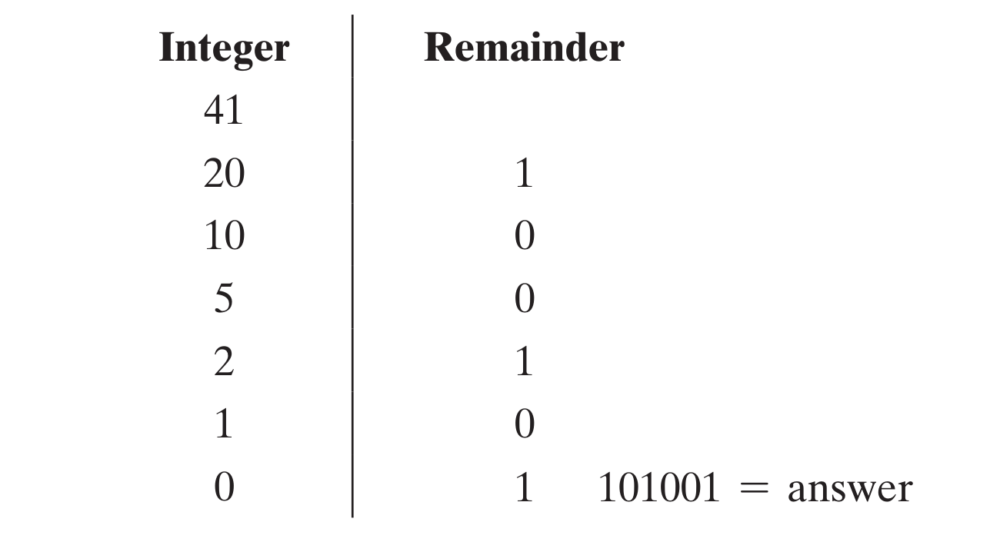
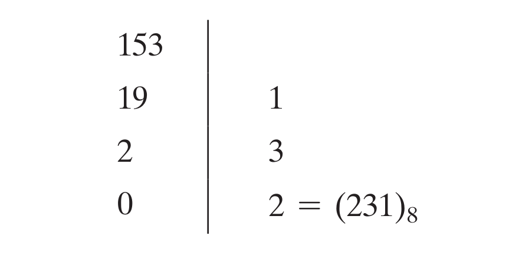
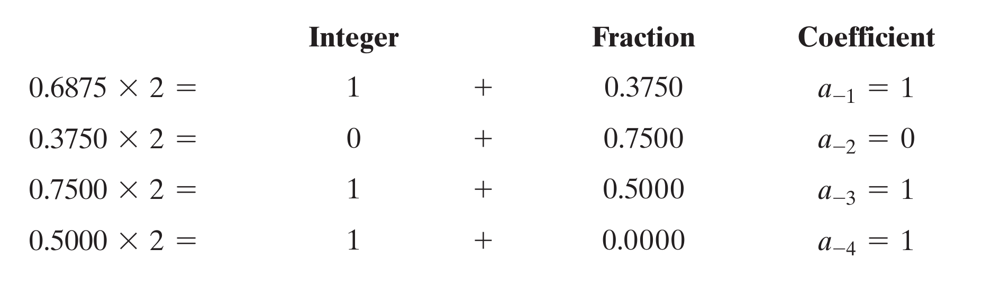
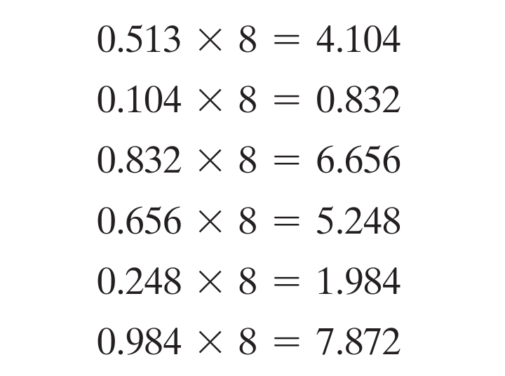

# Digital Systems and Binary Numbers

## 1.1. Digital Systems
* Hệ thống số làm việc với các đại lượng rời rạc.
* Các hệ thống số thường gặp: Hệ nhị phân (Binary - 2), hệ bát phân (Octal - 8), hệ thập lục phân (Hex - 16), hệ thập phân (Decimal - 10).

## 1.2. Binary Numbers
* Hệ thống số nhị phân được sử dụng trong máy tính và mạch số bởi sự thuận tiện của nó.
* Hệ nhị phân gồm 2 chữ số 0 (logic LOW) và 1 (logic HIGH).
* Một số được biểu diễn ở hệ cơ số (base - radix) r dưới dạng:
  * **(anan-1an-2...a1a0.a-1a-2...a-m)r**
* Biểu diễn trên có giá trị tương đương trong hệ thập phân là:
  * **an.rn + an-1.rn-1 + ... + a1.r + a0 + a-1.r-1 + a-2.r-2 + a-m.r-m**
* Hệ cơ số 8 sử dụng các chữ số từ 0 - 7 để biểu diễn số. Ex:
  * **(127.4)8 = 1 x 82 + 2 x 81 + 7 x 80 + 4 x 8-1 = (87.5)10</sbp>**
* Hệ cơ số 16 sử dụng các chữ số từ 0 - F (0123456789ABCDEF) để biểu diễn số. Ex:
  * **(B65F)16 = 11 x 163 + 6 x 162 + 5 x 161 + 15 x 160 = (46,687)10**
  * Hệ Hex rất thuận tiện để lưu trữ chuỗi số nhị phân. 1 chữ số hệ hex tương đương 4 chữ số hệ binary, 2 chữ số hệ hex tương đương 8 chữ số hệ binary = 1 byte.
* 210 = 1K (kilo). 220 = 1M (mega). 230 = 1G (giga). 240 = 1T (tetra). 

## 1.3. Number-Base Conversions
* Chuyển đổi hệ cơ số khác sang hệ thập phân: Triển khai biểu diễn như phần 1.2 bên trên.
* Chuyển đổi hệ thập phân -> hệ cơ số r: Chia ra 2 phần (phần nguyên và phần sau dấu chấm).
### Phần nguyên
* Chia số đó cho cơ số r, được thương và phần dư. Tiếp tục lấy thương chia cho r đến khi thương = 0. Viết các số dư theo thứ tự ngược lại.
* Ex: Chuyển số (41)10 sang hệ nhị phân: **(41)10 = (101001)2**
  
* Ex: Chuyển số (153)10 sang hệ octal: **(153)10 = (231)8**
  
### Phần thập phân
* Lấy phần thập phân nhân với cơ số r, được phần nguyên và phần thập phân mới. Tiếp tục lấy phần thập phân mới nhân với r đến khi phần thập phân mới = 0. Viết các phần nguyên theo thứ tự sẽ được biểu diễn tương đương trong hệ cơ số r.
* Ex: Chuyển số (0.6875)10 sang hệ nhị phân: **(0.6875)10 = (0.a-1a-2a-3a4)2 = (0.1011)2**
  
* Ex: Chuyển số (0.513)10 sang hệ octal: **(0.513)10 = (0.406517...)8**
  
* Lưu ý: Nếu phần thập phân mới không bao giờ = 0, ta sẽ thu được một biểu diễn tương tự số vô tỉ trong hệ decimal. Ngừng phép nhân khi đã đạt đủ độ chính xác cần thiết sau dấu chấm. 1 số hữu tỉ trong hệ decimal có thể là 1 số vô tỉ trong hệ cơ số khác và ngược lại.
### Biểu diễn đầy đủ
* Sau khi chuyển đổi phần nguyên và phần thập phân, ta kết hợp lại sẽ có biểu diễn đầy đủ:
  * **(41.6875)10 = (101001.1011)2**
  * **(153.513)10 = (231.406517...)8**

## 1.4. Octal and Hexadecimal Numbers
* Sự chuyển đổi giữa các hệ số binary, octal và hexa rất thường gặp.
* 1 chữ số hệ octal = 3 chữ số hệ binary. 1 chữ số hệ hexa = 4 chữ số hệ binary.
* Chuyển từ binary -> octal: nhóm từng bộ 3 chữ số binary lại, rồi chuyển từng bộ số.
  * Ex: **(10110001101011.111100000110)2 = (10 110 001 101 011 . 111 100 000 110)2 = (26153.7406)8**
* Chuyển từ binary -> hexa: nhóm từng bộ 4 chữ số binary lại, rồi chuyển từng bộ số.
  * Ex: **(10110001101011.111100000110)2 = (10 1100 0110 1011 . 1111 0000 0110)2 = (2C6B.F26)16**
* Chuyển từ octal hoặc hexa sang binary: làm ngược lại. Chuyển từng chữ số sang binary. Padding thêm 0 phía trước cho đủ bộ số.
  * Ex: **(306.D)16 = (0011 0000 0110 . 1101)2**
* Hệ hexa rất hữu ích để lưu trữ, vì sự dễ dàng chuyển đổi sang binary và sự ngắn gọn trong biểu diễn số.

## 1.5. Complements of Numbers
* Biểu diễn số dạng phần bù: hữu ích khi cần thực hiện các phép toán với số âm, hoặc phép toán trừ, giúp đơn giản hóa thiết kế mạch số cũng như tiết kiệm chi phí khi thực thi mạch số.
* Có 2 loại phần bù: **Bù cơ số** - **Bù r** (radix complement) và **Bù cơ số giản lược** - **Bù (r-1)** (deminished radix complement).
* Ex: Với hệ binary: **Bù 2** và **Bù 1**. Với hệ decimal: **Bù 10** và **Bù 9**.
### Bù (r-1) (Deminished Radix Complement)
* Định nghĩa: Cho 1 số N có n chữ số trong hệ cơ số r. **Bù (r-1) của N = (rn - 1) - N**.
* Với hệ decimal:
  * N = 10 nên (10n - 1) sẽ là 1 số có n chữ số 9. Ex: n = 4 => 104 = 10,000 và (104 - 1 = 9,999).
  * Như vậy, **để tìm Bù 9 của 1 số decimal, chỉ cần trừ 9 cho mỗi chữ số của nó**.
  * Ex: Bù 9 của 546700 = 999999 - 546700 = 453299.
* Tương tự, với hệ binary:
  * N = 2 nên (2n - 1) sẽ là 1 số có n chữ số 1. Ex: n = 4 => 24 = 10000 và (24 - 1 = 1111).
  * Vì 1-0=1 và 1-1=0. **Để tìm Bù 1 của 1 số binary, chỉ cần thay đổi mỗi chữ số 0 thành 1, 1 thành 0**.
  * Ex: Bù 1 của 1011000 = 0100111.
### Bù r (Radix Complement)
* Định nghĩa: Cho 1 số N có n chữ số trong hệ cơ số r. **Bù r của N = rn - N nếu N # 0 và bằng 0 với N = 0**.
* So sánh với dạng **Bù (r-1)**, ta thấy rằng **Bù r = Bù (r-1) + 1** => Muốn tìm **Bù r**, ta tìm **Bù (r-1)** rồi + thêm 1 vào kết quả.
* Mẹo tính nhanh **Bù 10** trong hệ decimal: Tính từ phải qua, giữ nguyên các chữ số 0 liên tục. Với chữ số # 0 đầu tiên, lấy 10 trừ chữ số đó. Các chữ số còn lại bên trái, lấy 9 trừ đi chữ số đó.
  * Ex: Tìm **Bù 10** của 246700: giữ nguyên 2 chữ số 0 cuối cùng. Lấy 10 - 7 được 3. Lấy 999 - 246 được 753. Kết quả: **753300**.
 * Mẹo tính nhanh **Bù 2** trong hệ binary: Tính từ phải qua, giữ nguyên các chữ số 0 liên tục và chữ số 1 đầu tiên. Các chữ số còn lại bên trái, thay 1 thành 0, thay 0 thành 1.
   * Ex: Tìm **Bù 2** của 1101100: giữ nguyên ...100. Thay 1101... thành 0010... Kết quả: **0010100**.
 * Đối với số có dấu chấm thập phân, tạm thời loại bỏ dấu chấm, tìm phần bù tương ứng rồi thêm dấu chấm vào đúng vị trí cũ.
 * Phần bù của phần bù = số ban đầu.
