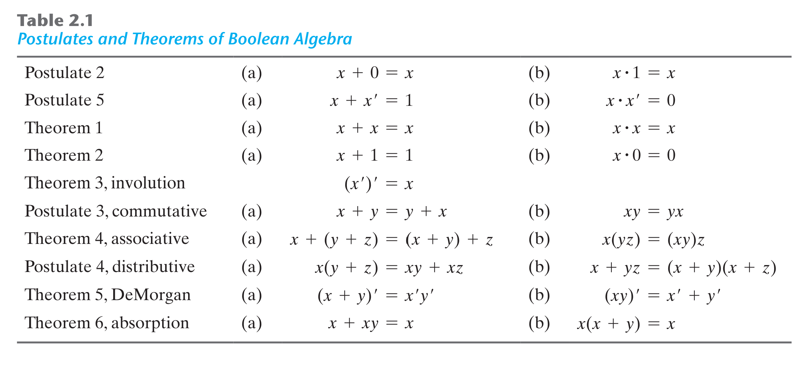
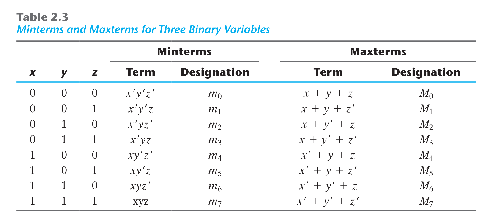
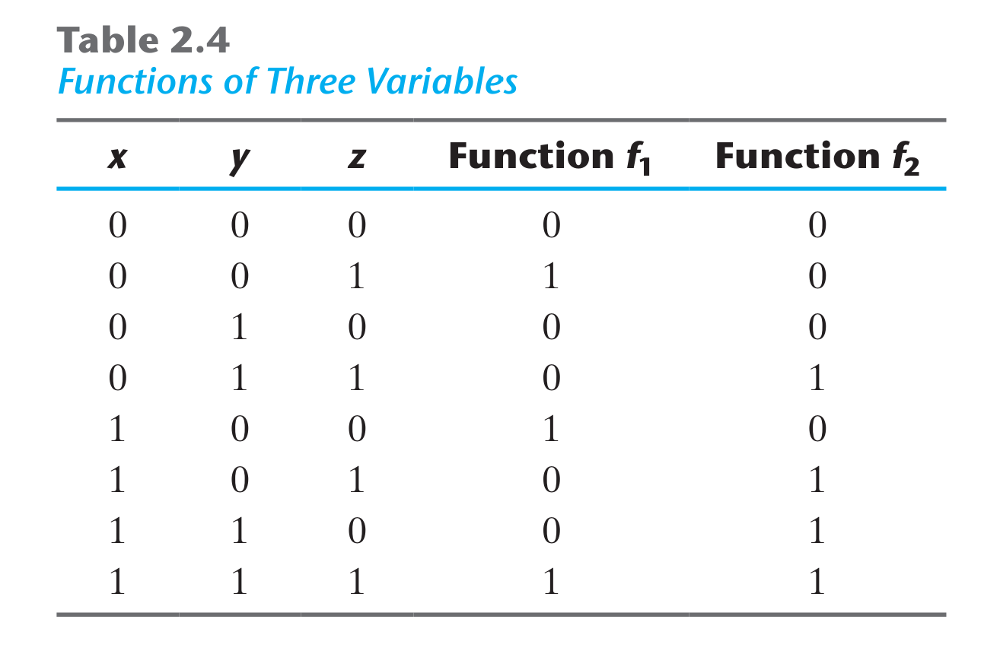

# 2. BOOLEAN ALGEBRA AND LOGIC GATES

# 2.1. Giới thiệu
* Chi phí để thực thi mạch số là yếu tố quan trọng.
* Ta sẽ học các phương pháp toán học gọi là Đại số Boolean để đơn giản hóa cũng như tối ưu hóa các mạch số.

# 2.2. Định nghĩa
* Cho 1 tập S gồm 1 số phần tử xác định. Xét 1 phép toán nhị phân "*".
* *Cấu trúc đại số* được xây dựng dựa trên 6 tiên đề cơ sở:
  * **Tính bao đóng**:  Tập S là *bao đóng* đối với phép toán "*", nếu với mỗi cặp phần tử thuộc S, phép toán sẽ cho kết quả là 1 phần tử xác định thuộc S. Ví dụ, với tập số tự nhiên N = {1, 2, 3, ...} là *bao đóng* với phép toán "+", vì với mọi a, b thuộc N, luôn tìm được số c = a + b cũng thuộc N. Tuy nhiên tập N là không bao đóng với phép toán "-".
  * **Luật kết hợp**: *(x * y) * z = x * (y * z)* với mọi x, y, z thuộc S.
  * **Luật giao hoán**: *x * y = y * x* với mọi x, y, z thuộc S.
  * **Luật phần tử đơn vị**: Tồn tại phần tử đơn vị *e* sao cho: *e * x = x * e* với mọi x thuộc S.
  * **Phép đảo**: Nếu e là phần tử đơn vị của S với phép toán "*". Với mọi x thuộc S, tồn tại phần tử y thuộc S sao cho: *x * y = e*.
  * **Luật phân phối**: Nếu " * " và "+" là 2 phép toán nhị phân trong S, "*" được gọi là có tính phân phối đối với "+" nếu: *x * (y + z) = x * y + x * z*.

# 2.3. Đại số Boolean
* **Đại số Boolean** là 1 cấu trúc đại số, gồm 1 tập B cùng 2 phép toán "+" và "*" thỏa mãn các tiên đề Huntington:
  * **Tính bao đóng**: với cả phép "+" và phép "*".
  * **Luật phần tử đơn vị**:
    * (a) 0 là phần tử đơn vị của phép "+": *x + 0 = 0 + x = x*.
    * (b) 1 là phần tử đơn vị của phép "*": *x * 1 = 1 * x = x*.
  * **Luật giao hoán**:
    * (a) *x + y = y + x*.
    * (b) *x * y = y * x*.
  * **Luật phân phối**:
    * (a) của phép "*" đối với phép "+": *x * (y + z) = x * y + x * z*.
    * (b) của phép "+" đối với phép "*": *x + y * z = (x + y) * (x + z)*.
  * **Phép đảo**: Với mọi x thuộc B, luôn tồn tại phần bù x' thuộc B thỏa mãn:
    * (a) *x + x' = 1*
    * (b) *x * x' = 0*
  * Có ít nhất 2 phần tử riêng biệt x, y thuộc B.
* Ở đây, ta chỉ quan tâm đến đại số Boolean 2 giá trị (tập B chỉ gồm 2 phần tử).

## Đại số Boolean 2 giá trị.
* Tập B = {0, 1} với 2 phép toán "*" (tương đương phép toán AND) và "+" (tương đương phép toán OR) và phép đảo (tương đương phép toán NOT) thỏa mãn 6 tiên đề Huntington.

# 2.4. Các định lý cơ bản và đặc điểm của Đại số Boolean
## Tính nhị nguyên
* Với 1 định lý cho trước, ta chỉ cần thay đổi OR - AND, đổi 0 - 1 sẽ được 1 định lý đúng khác.

## Các định lý cơ bản
Có 6 định lý cơ bản, các định lý có thể chứng minh từ các tiên đề.

## Thứ tự ưu tiên phép toán
* Thứ tự ưu tiên giảm dần: dấu ngoặc > NOT > AND > OR.
* Ex: Rút gọn hàm *F = x'y'z + xyz + x'yz + xy'z = x'z*(y' + y) + xz*(y' + y) = x'z + xz = (x' + x)z = 1.z = z*.

# 2.5. Hàm Boolean
* 1 hàm Boolean có thể biểu diễn dưới dạng đại số hoặc dạng bảng chân trị.
* 1 hàm Boolean có thể chuyển từ dạng đại số sang sơ đồ cổng logic. Ta nên sử dụng các định lý trong đại số Boolean để rút gọn hàm trước khi thực thi bằng cổng logic để tiết kiệm chi phí.

## Phần bù của 1 hàm Boolean
* Phần bù của hàm F là hàm F' có được bằng cách thay các giá trị 0 thành 1, 1 thành 0 trong bảng chân trị. Hoặc áp dụng định lý DeMorgan bằng cách: thay các phép toán AND thành OR và ngược lại, đồng thời lấy phần bù các toán hạng. Ex:
  * Với *F1 = x'yz' + x'y'z* thì *F1' = (x'yz' + x'y'z)' = (x'yz')'(x'y'z)' = (x + y' + z)(x + y + z')*.
  * Với *F2 = x(y'z' + yz)* thì *F2' = [x(y'z' + yz)]' = x' + (y'z' + yz)' = x' + (y'z')'(yz)' = x' + (y + z)(y' + z') = x' + yz' + y'z*.

# 2.6. Dạng chính tắc và dạng chuẩn
## Minterm và Maxterm
* Xét 2 biến x, y và phép toán AND sẽ tạo ra 4 tổ hợp phép toán: x'y', x'y, xy', xy. Mỗi biểu diễn này được gọi là 1 **minterm** (tích chuẩn).
* Với n biến có thể hình thành 2n **minterm**, ký hiệu từ **m0** đến **mn-1**.
* Tương tự, xét phép toán OR với n biến sẽ hình thành 2n tổ hợp phép toán, gọi là **maxterm**, ký hiệu từ **M0** đến **Mn-1**.

* 1 hàm Boolean có thể biểu diễn dưới dạng **sum of minterms** hoặc dạng **product of maxterms**, đây là dạng *chính tắc*. Ex:

  * *f1 = x'y'z + xy'z' + xyz = m1 + m4 + m7*.
  * *f1' = x'y'z' + x'yz' + x'yz + xy'z + xyz' = m0 + m2 + m3 + m5 + m6*.
  * *f1 = (f1')' = (x+y+z)(x+y'+z)(x+y'+z')(x'+y+z')(x'+y'+z) = M0 * M2 * M3 * M5 * M6*.

## Sum of minterms
* Với n biến, ta có 2n minterms. Vì mỗi minterm có thể nhận giá trị 0 hoặc 1, nên có tổng cộng 22n hàm khác nhau.
* Để chuyển 1 hàm về dạng **sum of minterms**, ta triển khai biểu thức thành dạng tổng của các tích. Nếu tích nào còn thiếu biến, ta sẽ AND nó với *(x + x')* trong đó x là biến còn thiếu, sẽ thu được dạng **sum of minterms**.
* Ex: Chuyển hàm *F = A + B'C* sang dạng chính tắc **sum of minterms**:
  * Thành phần A thiếu 2 biến B và C. Áp dụng quy tắc trên: *A = A(B+B') = AB + AB'*. Vẫn còn thiếu biến C nên ta tiếp tục *AB + AB' = AB(C+C') + AB'(C+C') = ABC + ABC' + AB'C + AB'C'*.
  * Thành phần B'C thiếu biến A, nên *B'C = B'C(A+A') = AB'C + A'B'C*.
  * Kết hợp lại: *F = ABC + ABC' + AB'C + AB'C' + A'B'C = m1 + m4 + m5 + m6 + m7*.
  * Hay *F(A, B, C) = \sum(1, 4, 5, 6, 7)*.
