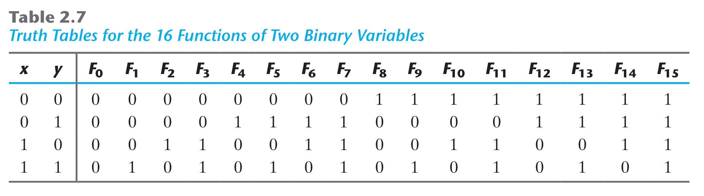
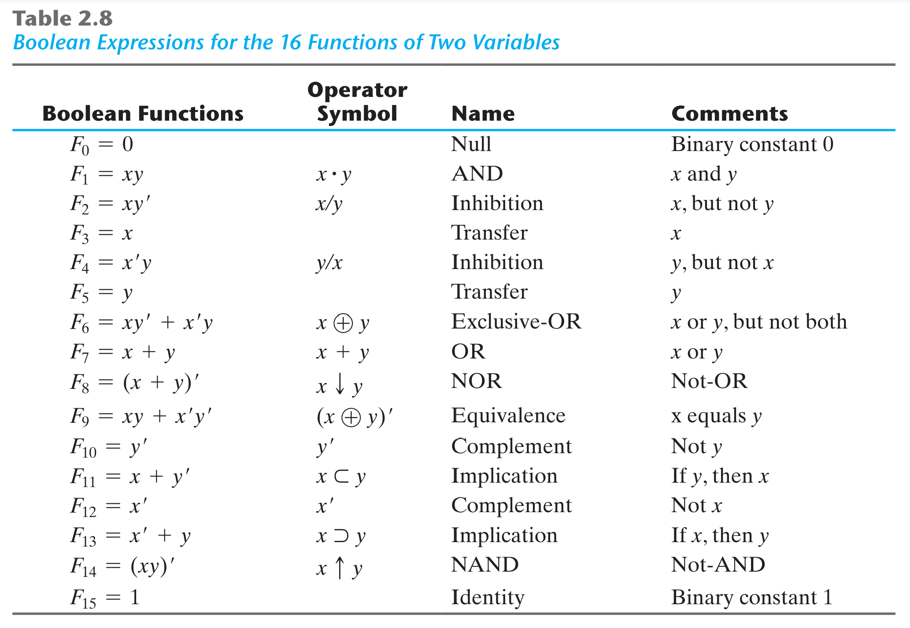
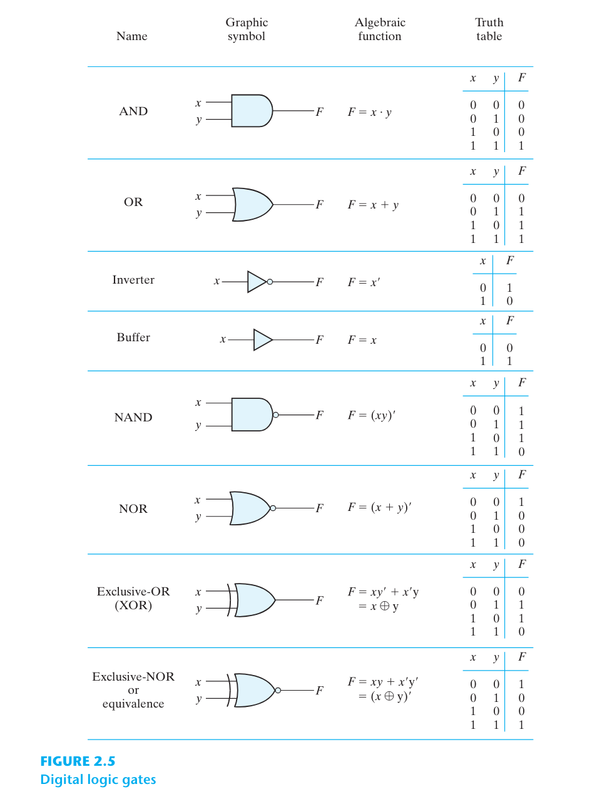
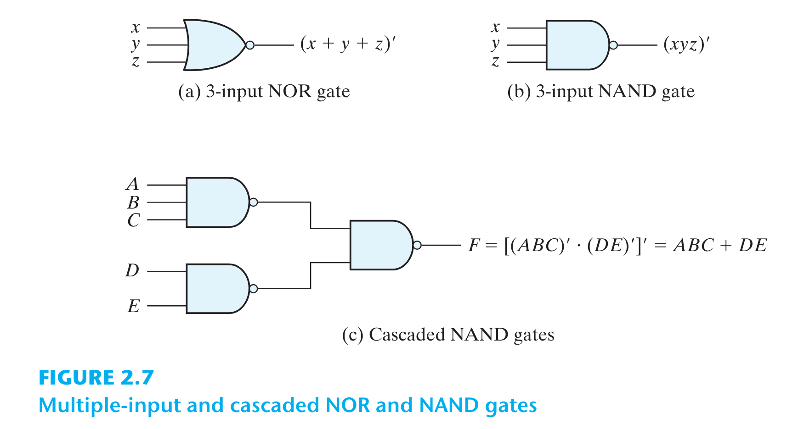

# 2. BOOLEAN ALGEBRA AND LOGIC GATES

# 2.1. Giới thiệu
* Chi phí để thực thi mạch số là yếu tố quan trọng.
* Ta sẽ học các phương pháp toán học gọi là Đại số Boolean để đơn giản hóa cũng như tối ưu hóa các mạch số.

# 2.2. Định nghĩa
* Cho 1 tập S gồm 1 số phần tử xác định. Xét 1 phép toán nhị phân "*".
* *Cấu trúc đại số* được xây dựng dựa trên 6 tiên đề cơ sở:
  * **Tính bao đóng**:  Tập S là *bao đóng* đối với phép toán "*", nếu với mỗi cặp phần tử thuộc S, phép toán sẽ cho kết quả là 1 phần tử xác định thuộc S. Ví dụ, với tập số tự nhiên N = {1, 2, 3, ...} là *bao đóng* với phép toán "+", vì với mọi a, b thuộc N, luôn tìm được số c = a + b cũng thuộc N. Tuy nhiên tập N là không bao đóng với phép toán "-".
  * **Luật kết hợp**: $(x * y) * z = x * (y * z)$ với mọi x, y, z thuộc S.
  * **Luật giao hoán**: $x * y = y * x$ với mọi x, y, z thuộc S.
  * **Luật phần tử đơn vị**: Tồn tại phần tử đơn vị *e* sao cho: $e * x = x * e$ với mọi x thuộc S.
  * **Phép đảo**: Nếu e là phần tử đơn vị của S với phép toán "*". Với mọi x thuộc S, tồn tại phần tử y thuộc S sao cho: $x * y = e$.
  * **Luật phân phối**: Nếu " * " và "+" là 2 phép toán nhị phân trong S, "*" được gọi là có tính phân phối đối với "+" nếu: $x * (y + z) = x * y + x * z$.

# 2.3. Đại số Boolean
* **Đại số Boolean** là 1 cấu trúc đại số, gồm 1 tập B cùng 2 phép toán "+" và "*" thỏa mãn các tiên đề Huntington:
  * **Tính bao đóng**: với cả phép "+" và phép "*".
  * **Luật phần tử đơn vị**:
    * (a) 0 là phần tử đơn vị của phép "+": $x + 0 = 0 + x = x$.
    * (b) 1 là phần tử đơn vị của phép "*": $x * 1 = 1 * x = x$.
  * **Luật giao hoán**:
    * (a) $x + y = y + x$.
    * (b) $x * y = y * x$.
  * **Luật phân phối**:
    * (a) của phép "*" đối với phép "+": $x * (y + z) = x * y + x * z$.
    * (b) của phép "+" đối với phép "*": $x + y * z = (x + y) * (x + z)$.
  * **Phép đảo**: Với mọi x thuộc B, luôn tồn tại phần bù x' thuộc B thỏa mãn:
    * (a) $x + x' = 1$
    * (b) $x * x' = 0$
  * Có ít nhất 2 phần tử riêng biệt x, y thuộc B.
* Ở đây, ta chỉ quan tâm đến đại số Boolean 2 giá trị (tập B chỉ gồm 2 phần tử).

## Đại số Boolean 2 giá trị.
* Tập B = {0, 1} với 2 phép toán "*" (tương đương phép toán AND) và "+" (tương đương phép toán OR) và phép đảo (tương đương phép toán NOT) thỏa mãn 6 tiên đề Huntington.

# 2.4. Các định lý cơ bản và đặc điểm của Đại số Boolean
## Tính nhị nguyên
* Với 1 định lý cho trước, ta chỉ cần thay đổi OR - AND, đổi 0 - 1 sẽ được 1 định lý đúng khác.

## Các định lý cơ bản
Có 6 định lý cơ bản, các định lý có thể chứng minh từ các tiên đề.

## Thứ tự ưu tiên phép toán
* Thứ tự ưu tiên giảm dần: dấu ngoặc > NOT > AND > OR.
* Ex: Rút gọn hàm $F = x'y'z + xyz + x'yz + xy'z = x'z*(y' + y) + xz*(y' + y) = x'z + xz = (x' + x)z = 1.z = z$.

# 2.5. Hàm Boolean
* 1 hàm Boolean có thể biểu diễn dưới dạng đại số hoặc dạng bảng chân trị.
* 1 hàm Boolean có thể chuyển từ dạng đại số sang sơ đồ cổng logic. Ta nên sử dụng các định lý trong đại số Boolean để rút gọn hàm trước khi thực thi bằng cổng logic để tiết kiệm chi phí.

## Phần bù của 1 hàm Boolean
* Phần bù của hàm F là hàm F' có được bằng cách thay các giá trị 0 thành 1, 1 thành 0 trong bảng chân trị. Hoặc áp dụng định lý DeMorgan bằng cách: thay các phép toán AND thành OR và ngược lại, đồng thời lấy phần bù các toán hạng. Ex:
  * Với $F1 = x'yz' + x'y'z$ thì $F1' = (x'yz' + x'y'z)' = (x'yz')'(x'y'z)' = (x + y' + z)(x + y + z')$.
  * Với $F2 = x(y'z' + yz)$ thì $F2' = [x(y'z' + yz)]' = x' + (y'z' + yz)' = x' + (y'z')'(yz)' = x' + (y + z)(y' + z') = x' + yz' + y'z$.

# 2.6. Dạng chính tắc và dạng chuẩn
## Minterm và Maxterm
* Xét 2 biến x, y và phép toán AND sẽ tạo ra 4 tổ hợp phép toán: $x'y', x'y, xy', xy$. Mỗi biểu diễn này được gọi là 1 **minterm** (tích chuẩn).
* Với n biến có thể hình thành $2^n$ **minterm**, ký hiệu từ $m_0$ đến $m_{n-1}$.
* Tương tự, xét phép toán OR với n biến sẽ hình thành $2^n$ tổ hợp phép toán, gọi là **maxterm**, ký hiệu từ $M_0$ đến $M_{n-1}$.

* 1 hàm Boolean có thể biểu diễn dưới dạng **sum of minterms** hoặc dạng **product of maxterms**, đây là dạng *chính tắc*. Ex:

  * $f1 = x'y'z + xy'z' + xyz = m_1 + m_4 + m_7$.
  * $f1' = x'y'z' + x'yz' + x'yz + xy'z + xyz' = m_0 + m_2 + m_3 + m_5 + m_6$.
  * $f1 = (f1')' = (x+y+z)(x+y'+z)(x+y'+z')(x'+y+z')(x'+y'+z) = M_0 * M_2 * M_3 * M_5 * M_6$.

## Sum of minterms
* Với n biến, ta có $2^n$ minterms. Vì mỗi minterm có thể nhận giá trị 0 hoặc 1, nên có tổng cộng $2^{2n}$ hàm khác nhau.
* Để chuyển 1 hàm về dạng **sum of minterms**, ta triển khai biểu thức thành dạng tổng của các tích. Nếu tích nào còn thiếu biến, ta sẽ AND nó với $(x + x')$ trong đó x là biến còn thiếu, sẽ thu được dạng **sum of minterms**.
* Ex: Chuyển hàm $F = A + B'C$ sang dạng chính tắc **sum of minterms**:
  * Thành phần A thiếu 2 biến B và C. Áp dụng quy tắc trên: $A = A(B+B') = AB + AB'$. Vẫn còn thiếu biến C nên ta tiếp tục $AB + AB' = AB(C+C') + AB'(C+C') = ABC + ABC' + AB'C + AB'C'$.
  * Thành phần B'C thiếu biến A, nên $B'C = B'C(A+A') = AB'C + A'B'C$.
  * Kết hợp lại: $F = ABC + ABC' + AB'C + AB'C' + A'B'C = m_1 + m_4 + m_5 + m_6 + m_7$.
  * Hay $F(A, B, C) = \sum(1, 4, 5, 6, 7)$.

## Product of maxterms
* Mỗi trong số $2^{2n}$ hàm với n biến có thể biểu diễn dưới dạng **product of maxterms**.
* Để chuyển đổi, ta có thể dụng luật phân phối $x + yz = (x+y)(x+z)$. Thành phần nào còn thiếu biến (ví dụ thiếu biến x) thì ta OR thêm với $xx'$.
* Ex: Chuyển hàm $F = xy + x'z$ sang dạng **product of maxterms**.
  * $F = xy + x'z = (xy + x')(xy + z) = (x + x')(y + x')(x + z)(y + z) = (x' + y)(x + z)(y + z)$.
  * Mỗi số hạng trên đều thiếu 1 biến. Ta tiến hành OR thêm với $xx'$ (nếu thiếu biến x):
    * $x' + y = x' + y + zz' = (x' + y + z)(x' + y + z')$.
    * $x + z = x + z + yy' = (x + y + z)(x + y' + z)$.
    * $y + z = y + z + xx' = (x + y + z)(x' + y + z)$.
  * Kết hợp các số hạng lại, thành phần nào trùng lắp thì bỏ đi vì ta có định lý $x * x = x$. Thu được:
    * $F = (x + y + z)(x + y' + z)(x' + y + z)(x' + y + z') = M_0M_2M_4M_5$.
    * Hay $F = \prod(0, 2, 4, 5)$.

## Chuyển đổi giữa 2 dạng chính tắc
* Giả sử $F(A, B, C) = \sum(1, 4, 5, 6, 7)$.
* Lấy phần bù ta được $F'(A, B, C) = \sum(0, 2, 3) = m_0 + m_2 + m_3$.
* Tiếp tục lấy phần bù lần 2, áp dụng định lý DeMorgan ta được:
  * $F = (m_0 + m_2 + m_3)' = m'_0 * m'_2 * m'_3 = M_0M_2M_3 = \prod(0, 2, 3)$.
* Như vậy, để chuyển đổi giữa 2 dạng chính tắc, ta đổi $\sum$ thành $\prod$ và liệt kê các term còn thiếu trong list.
* Ex: $F = xy + x'z = \sum(1, 3, 6, 7) = \prod(0, 2, 4, 5)$.

## Dạng chuẩn
* Dạng chính tắc là dạng cơ bản rút ra được từ bảng chân trị. Tuy nhiên, nó thường không phải là dạng ngắn gọn nhất vì mỗi số hạng đều phải chứa tất cả các biến.
* 1 hàm Boolean có thể biểu diễn ở dạng chuẩn, trong đó mỗi toán hạng có thể chứa 1, 2, ... biến.
* Có 2 dạng chuẩn:
  * **sum of products**: Ex: $F_1 = x' + xy + x'yz'$.
  * **product of sums**: Ex: $F_2 = x(y' + z)(x' + y + z')$.
* Các hàm dạng chuẩn khi chuyển sang sơ đồ cổng logic sẽ ở dạng thực thi 2 mức.
* Ví dụ về hàm không chuẩn: $F_3 = AB + C(D + E)$. Khi thực thi mạch số này sẽ là thực thi 3 mức.
* Hàm chuẩn được ưa thích hơn vì khi thực thi 2 mức sẽ giảm thiểu thời gian delay cổng.

# 2.7. Các phép toán logic khác
* Ta biết rằng, với n biến, sẽ có $2^{2n}$ hàm khác nhau. Với n = 2, sẽ có tổng cộng 16 hàm Boolean. AND và OR chỉ là 2 trong số 16 hàm này. Giờ ta sẽ tìm 14 hàm còn lại. Bảng chân trị cho 16 hàm này (ký hiệu $F_0 -> F_15$) được cho trong hình sau:

* 16 hàm này có thể biểu diễn bằng các hàm Boolean như trong hình sau. Mặc dù, mỗi hàm này đều có thể biểu diễn dưới dạng các phép toán AND, OR, NOT. Tuy nhiên, ta hoàn toàn có thể gán các ký hiệu khác cho các phép toán này. Nhưng trong số các phép toán mới này, chỉ có phép toán XOR là thường được dùng trong mạch số.

* 16 hàm này có thể chia làm 3 loại:
  * 2 hàm sinh ra kết quả xác định 0 hoặc 1.
  * 4 hàm với phép toán 1 toán hạng: phép bù, phép chuyển.
  * 10 hàm với phép toán nhị phân định nghĩa nên 8 loại phép toán khác nhau: AND, OR, NAND, NOR, XOR, XNOR, phép cấm (Inhibition), phép kéo theo (Implication).
* Trong 8 phép toán nhị phân trên, Inhibition và Implication thường được dùng bởi các nhà logic học, nhưng hiếm khi dùng trong logic máy tính.
* Đại số Boolean sử dụng các phép toán AND, OR, NOT. Các phép toán khác có thể suy ra từ định nghĩa của các phép toán cơ bản này. Tuy nhiên, ta hoàn toàn có thể bắt đầu với định nghĩa của 1 phép toán bất kỳ, ví dụ NOR, rồi suy ra các phép toán còn lại.

# 2.8. Các cổng logic số
* Trong số 16 hàm logic trên, chỉ có 8 hàm: phép bù, phép chuyển, AND, OR, NAND, NOR, XOR, XNOR được sử dụng để xây dựng các cổng logic số.
* Cổng NAND và cổng NOR là các cổng logic chuẩn, được sử dụng còn phổ biến hơn các cổng AND, OR. Vì cổng NAND và NOR dễ xây dựng từ các mạch transitor, và các mạch số cũng dễ thực thi với các cổng này.

## Cổng mở rộng với nhiều input
* Ngoài cổng Inverter, cổng Buffer, 6 cổng còn lại có thể mở rộng thành dạng nhiều hơn 2 input.
* Ví dụ về các cổng nhiều input:

## Positive logic và Negative logic
Tín hiệu nhị phân (input hoặc output) của các cổng sẽ có 2 giá trị HIGH hoặc LOW. Ta hoàn toàn có thể lựa chọn giá trị HIGH để biểu diễn logic 1 hay logic 0 tùy ý. Nếu chọn HIGH biểu diễn logic 1, ta sẽ có hệ thống *Positive logic*, nếu chọn LOW biểu diễn logic 1, ta sẽ có *Negative logic*. Ở đây ta chỉ quan tâm đến *Positive logic*.

# 2.9. Mạch tích hợp IC
Các IC được phân loại theo độ phức tạp của mạch số, đo bởi số lượng cổng logic (hoặc transitor) trong mạch. IC được chia thành:
  * SSI (Small-scale integration): < 10 cổng.
  * MSI (Medium-scale integration): 10 - 1000 cổng. Ex: decoder, adder, multiplexer, register, counter.
  * LSI (Large-scale integration): > 1000 cổng. Ex: processor, memory chip.
  * VLSI (Very large-scale integration) và ULSI (Ultra large-scale integration): chứa hàng triệu cổng logic.

## Các họ logic số
Các IC không chỉ được phân loại bởi độ phức tạp, mà còn phân loại dựa trên công nghệ chế tạo các cổng logic. Một số họ thường gặp:
  * TTL: transitor-transitor logic.
  * ECL: emitter-coupled logic.
  * MOS: metal-oxide semiconductor.
  * CMOS: complementary metal-oxide semiconductor.
