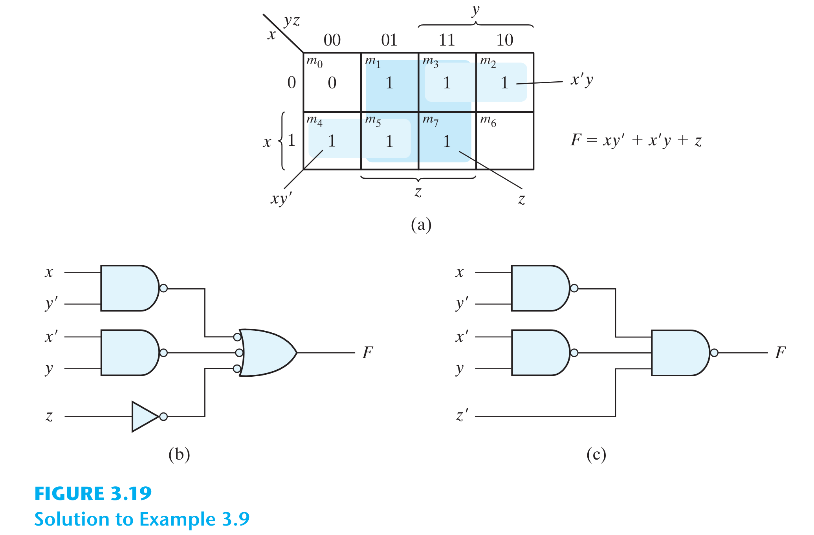

# CHAPTER 3 - GATE-LEVEL MINIMIZATION

# 3.1. Introduction

# 3.2. The Map Method
* Phương pháp bìa Karnaugh hay K-map giúp đơn giản hóa hàm Boolean 1 cách hệ thống, đảm bảo thu được hàm tối thiểu giúp tiết kiệm chi phí thiết kế.
* K-map là phương pháp trực quan, rất hữu ích với hàm <= 4 biến. Với hàm > 4 biến, phương pháp trở nên phức tạp và không trực quan.

## K-map 2 biến

## K-map 3 biến

## K-map 4 biến

* Các minterms được sắp xếp theo Gray code, nhằm đảm bảo 2 minterm liền kề chỉ khác nhau 1 bit.
* 2 minterm cùng hàng ở cạnh trái và cạnh phải được xem là liền kề. 2 minterm cùng cột ở cạnh trên và cạnh dưới được xem là liền kề. 4 minterm ở 4 góc cũng được xem là liền kề.
* Hàm phải được viết ở dạng **sum of products**.
* Các minterms liền kề (tạo thành hình chữ nhật) khi kết hợp sẽ giúp loại bỏ bớt biến trong biểu diễn cuối cùng:
  * 1 ô -> term có 4 biến.
  * 2 ô liền kề -> term có 3 biến.
  * 4 ô liền kề -> term có 2 biến.
  * 8 ô liền kề -> term có 1 biến.
  * 16 ô liền kề -> hàm có giá trị = 1.
* Ưu tiên gom thành các nhóm lớn trước, nhóm nhỏ sau. Các ô có thể được gom nhóm nhiều lần.
* Ex: Tối giản hàm $F(w, x, y, z) = \sum(0, 1, 2, 4, 5, 6, 8, 9, 12, 13, 14) = y' + w'z' + xz'$.

* Ex: Tối giản hàm $F = A'B'C' + B'CD' + A'BCD' + AB'C' = B'D' + B'C' + A'CD'$.

## Prime Implicants
* Mỗi product term là 1 implicant.
* 1 implicant là prime implicant nếu nó là implicant lớn nhất, không thể chứa trong các implicant lớn hơn. Ex: 4 ô liền kề hình thành 1 prime implicant nếu không có implicant 8 ô nào chứa nó.
* 1 prime implicant là essential nếu nó có chứa ít nhất 1 ô mà ô này chỉ có thể bao phủ bởi prime implicant đó. Essential prime implicant bắt buộc xuất hiện trong biểu thức cuối cùng.
* Ex: Tối giản hàm $F(A, B, C, D) = \sum(0, 2, 3, 5, 7, 8, 9, 10, 11, 13, 15)$.

* Hình (a) vẽ 2 essential prime implicants BD và B'D'.
  * BD là essential vì nó là prime implicant 4 ô duy nhất chứa ô $m_5$.
  * B'D' là essential vì nó là prime implicant 4 ô duy nhất chứa ô $m_0$.
* Hình (b) vẽ 4 prime implicants CD, B'C, AD, AB'. Chúng không phải là essential vì:
  * $m_3$ có thể được phủ trong prime implicant CD hoặc B'C.
  * $m_9$ có thể được phủ trong prime implicant AD hoặc AB'.
  * $m_{11}$ có thể được phủ trong cả 4 prime implicant này.
* Buổi thức cuối cùng sẽ là sự kết hợp của 2 essential implicant và các tổ hợp prime implicant bao phủ 3 ô $m_3, m_9, m_{11}$:
  * $F = BD + B'D' + CD  + AD$.
  * $F = BD + B'D' + CD  + AB'$.
  * $F = BD + B'D' + B'C + AD$.
  * $F = BD + B'D' + B'C + AB'$.

# 3.4. Đơn giản hóa hàm dạng Product of Sums
* Ta cũng có thể đơn giản hàm thành dạng **product of sums**.
* Ex: Tối giản hàm $F(A, B, C, D) = \sum(0, 1, 2, 5, 8, 9, 10)$ theo 2 dạng **sum of products** và **product of sums**.

* Áp dụng phương pháp K-map với các ô giá trị "1", ta có được: $F  = B'D' + B'C' + A'C'D$.
* Áp dụng phương pháp K-map với các ô giá trị "0", ta có được: $F' = AB + CD + BD'$.
* Áp dụng định lý DeMorgan ta được: $F = (F')' = (A' + B')(C' + D')(B' + D)$.
* 2 dạng biểu diễn trên khi thực thi mạch số sẽ được dạng thực thi cổng logic 2 mức:

# 3.5. Don't care condition
* Trong các ví dụ trên, mỗi ô trong bảng chân trị có giá trị xác định "1" hoặc "0".
* Tuy nhiên trong ứng dụng thực tế, một số hàm sẽ có kết quả không xác định (hoặc không quan trọng - don't care) đối với 1 số tổ hợp inputs.
* Minterm nào là don't care sẽ được ký hiệu là "X". Khi áp dụng K-map để tối giản hàm, ta có thể tùy ý chọn giá trị "1" hoặc "0" cho "X" sao cho đạt được biểu thức cuối cùng tối giản nhất.
* Ex: Tối giản hàm $F(w, x, y, z) = \sum(1, 3, 7, 11, 15)$ có các minterms don't care sau: $d(w, x, y, z) = \sum(0, 2, 5)$.

* Trên hình ta thấy có 2 cách tối giản: $F = yz + w'x'$ hoặc $F = yz + w'z$.
* Ngoài ra để tối giản hàm theo dạng *product of sums*, ta xét các ô "0" và được $F' = z' + wy'$ và $F = z(w' + y)$ (định lý DeMorgan).

# 3.6. Cổng NAND và NOR
* Cổng NAND và NOR dễ chế tạo hơn do cấu tạo mạch điện của nó. Ngoài ra, bất kể mạch logic nào cũng đều có thể chuyển đổi sang dạng kết hợp các cổng NAND hoặc NOR. Vì thế 2 cổng này có ưu điểm nổi trội hơn cổng AND, OR, NOT.

# NAND Circuits
* Chúng ta chỉ cần chứng minh rằng cổng AND, OR, NOT có thể tạo ra từ sự kết hợp các cổng NAND => tất cả mạch số đều có thể thực thi dưới dạng NAND circuits bằng cách chuyển đổi từ cổng AND, OR, NOT sang cổng NAND.
  * Cổng NOT được tạo thành từ cổng NAND khi nối input với 2 ngõ vào của NAND: $z = (x * x)' = x'$.
  * Cổng AND được tạo thành bằng cách kết nối 2 cổng NAND liên tục, với cổng NAND thứ 2 có ngõ vào là ngõ ra của cổng NAND thứ 1: $z = ((x * y)'(x * y)')' = ((x * y)')' = x * y$.
  * Cổng OR được tạo thành khi kết hợp 2 cổng NAND với ngõ vào của cổng NAND thứ 3: $z = (x' * y')' = x + y$.

* Để thuận tiện chuyển đối mạch số sang NAND circuits, ta có 2 cách biểu diễn cổng NAND trên sơ đồ logic: dạng **AND-invert** và dạng **invert-OR**. 2 dạng này là tương đương nhờ vào định lý DeMorgan.

## Thực thi cổng 2 mức
* Để thực thi hàm logic 2 mức với cổng NAND, trước tiên cần tối giản hàm dưới dạng *sum of products*.
* Ex: Hàm $F = AB + CD$ có thể chuyển đổi thành cổng NAND theo hình sau. Có thể chứng minh bằng định lý DeMorgan: $F = ((AB)'(CD)')' = AB + CD$.

* Ex: Hàm $F(x, y, z) = \sum(1, 2, 3, 4, 5, 7)$ ta được $F = xy' + x'y + z$. Tiến hành chuyển đổi cổng như hình sau.

## NAND Circuits nhiều mức
* Nếu hàm không ở dạng chuẩn, mạch logic sẽ được thực thi với nhiều mức cổng. Để chuyển các cổng sang NAND ta thực hiện các bước sau:
  * Chuyển các cổng AND thành cổng NAND dưới dạng AND-invert.
  * Chuyển các cổng OR thành cổng NAND dưới dạng invert-OR.
  * Check các bubbles (vòng tròn nhỏ) trên sơ đồ. Bubble nào chưa được bù thì thêm 1 inverter (cổng NAND 1 input) hoặc bù input.
* Ex: Thực thi hàm $F = (AB' + A'B)(C + D')$ dưới dạng cổng NAND.

## NOR Circuits
* 1 cách hoàn toàn tương tự, từ cổng NOR có thể xây dựng được cổng AND, OR, NOT, từ đó thực thi mọi hàm logic.
  * Cổng NOT được tạo thành từ cổng NOR khi nối input với 2 ngõ vào của NOR: $z = (x + x)' = x'$.
  * Cổng OR được tạo thành bằng cách kết nối 2 cổng NOR liên tục, với cổng NOR thứ 2 có ngõ vào là ngõ ra của cổng NOR thứ 1: $z = ((x + y)' + (x + y)')' = ((x + y)')' = x + y$.
  * Cổng AND được tạo thành khi kết hợp 2 cổng NOR với ngõ vào của cổng NOR thứ 3: $z = (x' + y')' = x * y$.
* Cổng NOR có thể biểu diễn trên sơ đồ logic ở 2 dạng: dạng **OR-invert** và dạng **invert-AND**.

* Để thực thi hàm logic 2 mức với cổng NOR, cần tối giản hàm dưới dạng *product of sums*.
* Ex: Thực thi hàm $F1 = (A + B)(C + D)E và F2 = (AB' + A'B)(C + D')$.

## Các dạng thực thi cổng logic 2 mức khác
* Nếu nối dây 2 ngõ ra của 2 cổng NAND, ta sẽ thu được dạng **wired-AND logic**:
  * $F = (AB)'(CD)' = (AB + CD)' = (A' + B')(C' + D')$.
  * Ta gọi đây là hàm dạng **AND-OR-INVERT**.
* Nếu nối dây 2 ngõ ra của 2 cổng NOR, ta sẽ thu được dạng **wired-OR logic**:
  * $F = (A + B)' + (C + D)' = [(A + B)(C + D)]'$.
  * Ta gọi đây là hàm dạng **OR-AND-INVERT**.

## Nondegenerate Forms
* Xét các dạng thực thi cổng 2 mức với 4 loại cổng AND, OR, NAND, NOR. Ta sẽ có 16 tổ hợp, ví dụ: AND-AND, NAND-OR, ...
* Trong đó, 8 tổ hợp là dạng thoái hóa (degenerate), nghĩa là có thể đơn giản hóa thành dạng thực thi 1 mức. Ví dụ: AND-AND có thể đơn giản hóa thành 1 cổng AND nhiều input.
* 8 tổ hợp còn lại là dạng nondegenerate được thực thi dưới dạng *sum of products* hoặc *product of sums*:
  * AND-OR, OR-AND: đây là 2 dạng cơ bản ta đã học.
  * NAND-NAND, NOR-NOR: ta vừa học xong.
  * NOR-OR, NAND-AND
  * OR-NAND, AND-NOR
* Giờ ta xem xét 4 tổ hợp còn lại.

## AND-OR-INVERT
* 2 tổ hợp NAND-AND và AND-NOR là tương đương. Chúng hình thành hàm dạng **AND-OR-INVERT**.

## OR-AND-INVERT
* 2 tổ hợp OR-NAND và NOR-OR là tương đương. Chúng hình thành hàm dạng **OR-AND-INVERT**.

## Tóm tắt dạng hàm tương đương

# 3.8. Hàm XOR
* Hàm XOR có các đặc điểm sau:
  * $x XOR 0 = x$
  * $x XOR 1 = x'$
  * $x XOR x = 0$
  * $x XOR x' = 1$
  * $x XOR y' = x' XOR y = (x XOR y)'$
  * $x XOR y = y XOR x$
  * $(x XOR y) xor z = x XOR (y XOR z) = x XOR y XOR z$
* Thực thi hàm XOR theo 2 dạng: dùng cổng AND, OR, NOT hoặc dùng cổng NAND.

## Odd function
* Hàm XOR nhiều input được dùng như 1 hàm để kiểm tra tổng số ngõ vào có giá trị = "1" là 1 số lẻ.
* Hàm $F = a XOR b XOR ... XOR z$ sẽ = "1" nếu tổng số input = "1" là 1 số lẻ.
* Ngược lại hàm NXOR là đảo của hàm XOR, dùng để kiểm tra tổng số ngõ vào có giá trị = "1" là một số chẵn.

## Parity generation và Checking
* Parity generator: $P = x \oplus y XOR z$.
* Parity checker: $C = x XOR y XOR z XOR P$.
