# CHAPTER 4 - COMBINATIONAL LOGIC

# 4.1. Introduction
Mạch logic được chia thành 2 loại:
* Mạch tổ hợp: Output chỉ phụ thuộc vào Inputs
* Mạch tuần tự: Có các phần tử nhớ lưu trữ thông tin trong mạch. Output phụ thuộc vào Inputs và trạng thái của các phần tử nhớ hiện tại.

# 4.2. Mạch tổ hợp

# 4.3. Phân tích mạch tổ hợp
Sơ đồ mạch tổ hợp chỉ gồm các cổng logic, không có đường hồi tiếp (feedback) hay phần tử nhớ (latch, flip-flop).

# 4.4. Quy trình thiết kế
## Mạch chuyển mã BCD -> Excess-3 code
* Tổ hợp bit tương ứng của *BCD* và *Excess-3* code được tổng hợp thành bảng chân trị sau:
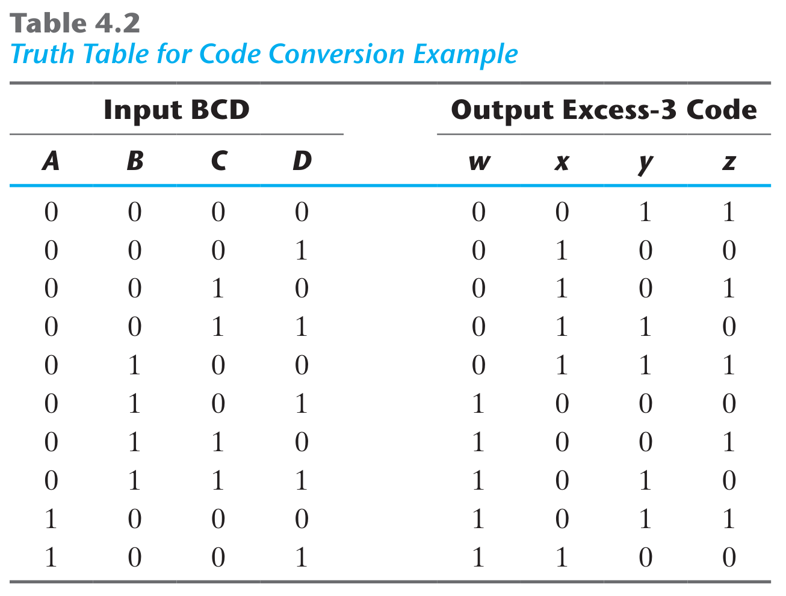
* Từ bảng chân trị ta xây dựng K-map cho từng bit output:
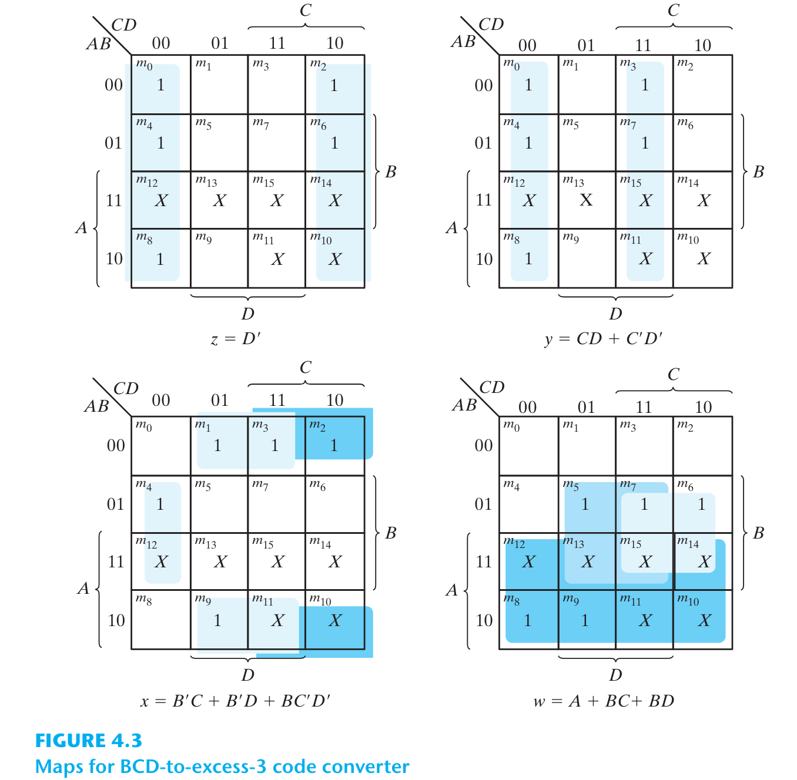
* Từ K-map trên thu được các hàm tối giản. Biến đổi hàm 1 chút để tạo nhân tử chung nhằm tận dụng cổng chung khi thực thi mạch:
  * $z = D'$.
  * $y = CD + C'D' = CD + (C + D)'$.
  * $x = B'C + B'D + BC'D' = B'(C + D) + BC'D' = B'(C + D) + B(C + D)'$.
  * $w = A + BC + BD = A + B(C + D)$.
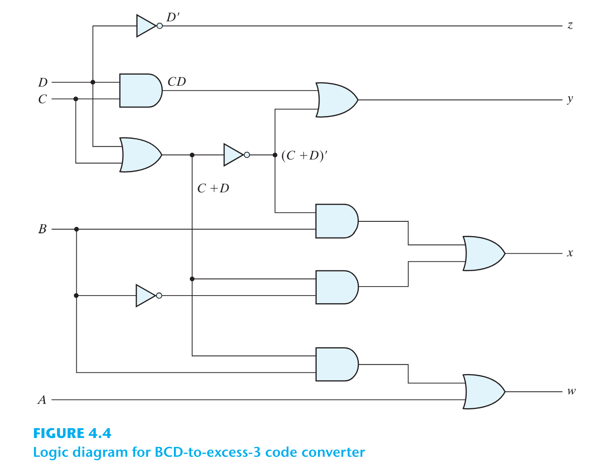
* Mạch thực thi gồm 4 cổng AND, 4 cổng OR, 2 cổng NOT. Nếu thực thi mạch theo dạng *sum of products* ban đầu thì cần đến 6 cổng AND, 3 cổng OR, 3 cổng NOT.
* Ta thấy không phải lúc nào hàm tối giản dạng chuẩn cũng là hàm tối ưu khi thực thi mạch, vì ta có thể tận dụng các subcircuits để tiết kiệm cổng. Các công cụ tổng hợp logic mặc định sẽ tìm và tận dụng các subcircuits này.

# 4.5. Binary Adder - Subtractor
* Mạch bán cộng (Half Adder) cộng 2 bit ở ngõ vào, đầu ra là 1 bit tổng và 1 bit nhớ.
* Mạch cộng toàn phần (Full Adder) có thêm 1 bit nhớ ở ngõ vào. Mạch cộng toàn phần có thể xây dựng từ 2 mạch bán cộng.
* Khi kết hợp n mạch cộng toàn phần thành chuỗi ta sẽ được mạch cộng nhị phân (Binary Adder).
* Có thể sửa đổi mạch cộng nhị phân 1 chút để có được mạch cộng-trừ nhị phân.

## Half Adder
* Half Adder cộng 2 bit data x, y. Ngõ ra gồm bit tổng S, bit nhớ C. Bảng chân trị:
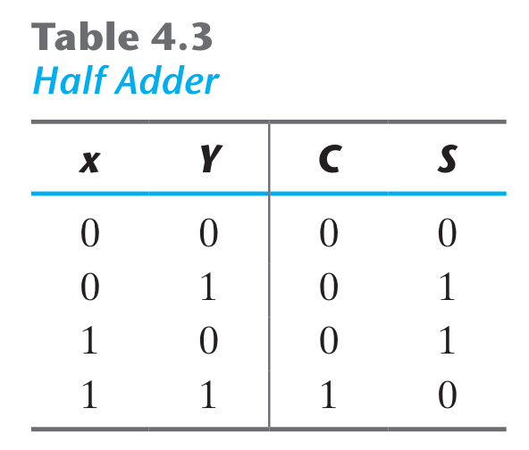
* Hàm thực thi dạng *sum of products*:
  * $S = x'y + xy'$.
  * $C = xy$.
* Mạch thực thi dạng *sum of products* trong hình (a). Hình (b) vẽ sơ đồ mạch dùng cổng XOR và cổng AND.
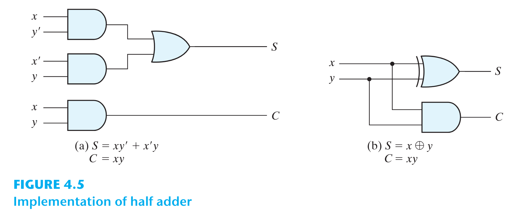

## Full Adder
* Full Addder thực hiện cộng 3 bit ngõ vào (2 bit data x, y và 1 bit nhớ z), sinh ra bit tổng S, bit nhớ C. Bảng chân trị:
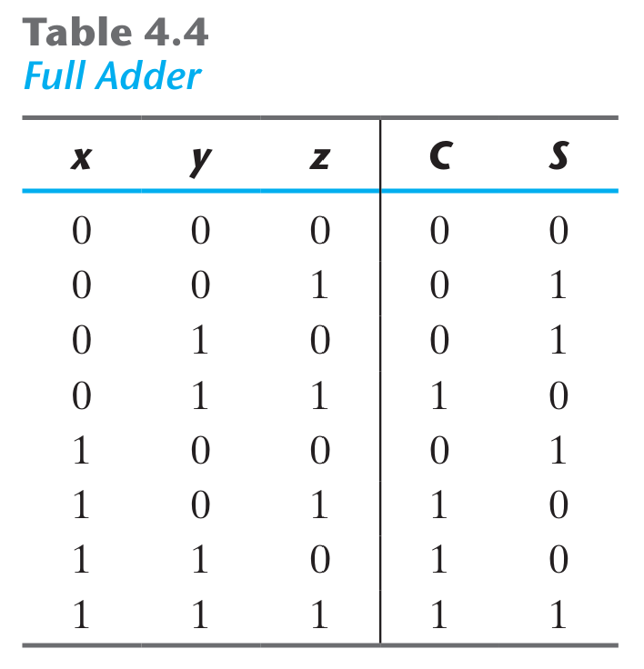
* Hàm thực thi dạng *sum of products*:
  * $S = x'y'z + x'yz' + xy'z' + xyz$.
  * $C = xy + xz + yz
* K-map cho output S và C:
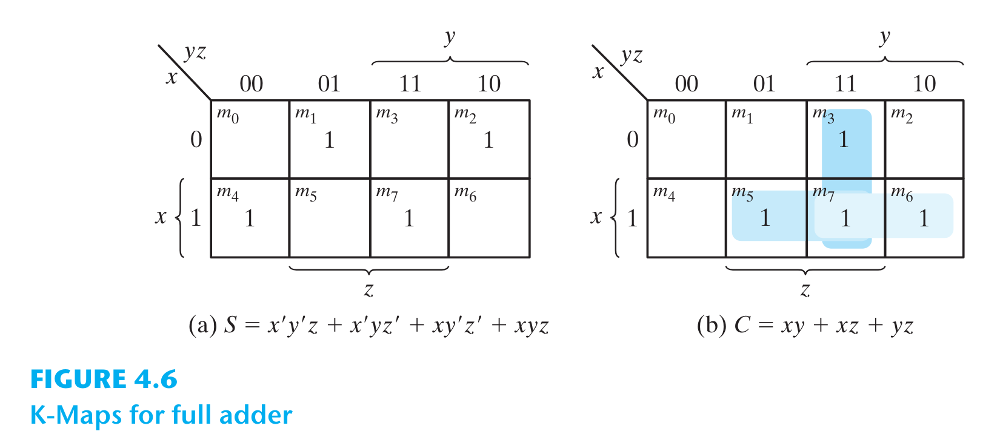
* Mạch thực thi dạng *sum of products* như sau:
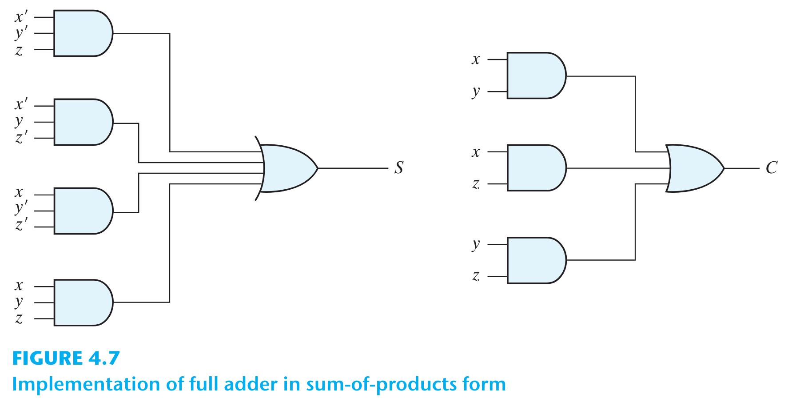
* Trong thực tế, người ta thường kết nối 2 mạch Half Adder để xây dựng Full Adder theo cách sau:
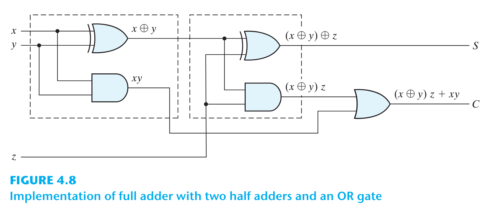
* Có thể chứng minh mạch này tương đương mạch *sum of products* ở trên:
  * $S = z \oplus (x \oplus y) = z'(xy' + x'y) + z(xy' + x'y)' = z'(xy' + x'y) + z(xy + x'y') = x'y'z + x'yz' + xy'z' + xyz$.
  * $C = z(x \oplus y) + xy = z(xy' + x'y) + xy = xy'z + x'yz + xy = xy(z + z + 1) + xy'z + x'yz$.
  * $C = xyz + xyz + xy + xy'z + x'yz = xy + xz(y + y') + yz(x + x') = xy + xz + yz$.

* Sơ đồ mạch Half Adder và Full Adder thực thi với các cổng NAND:

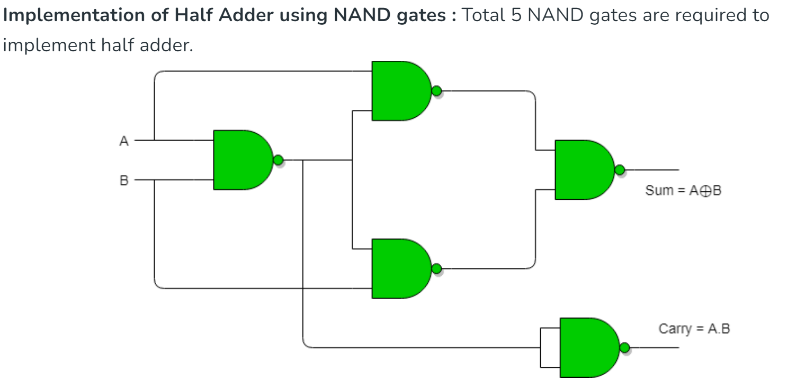
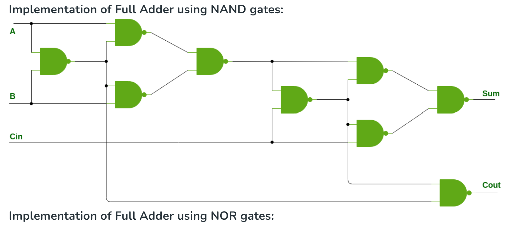

## Binary Adder
* Để tạo mạch Binary Adder cho 2 số n-bits, ta kết nối n mạch Full Adder, với C_out của $FA_i$ kết nối với C_in của $FA_{i-1}$.
* C_in của $FA_1$ sẽ kết nối với giá trị "0" (hoặc dùng 1 Half Adder thay thế).
* C_out của $FA_n$ sẽ trở thành bit nhớ, cho biết phép cộng có tràn số hay không.
* Mạch kết nối kiểu này được gọi là mạch cộng **Ripple Carry**, vì bit nhớ chạy qua từng FA từ C_in đầu tiên đến C_out cuối cùng.
* Ví dụ về mạch 4-bit Adder:
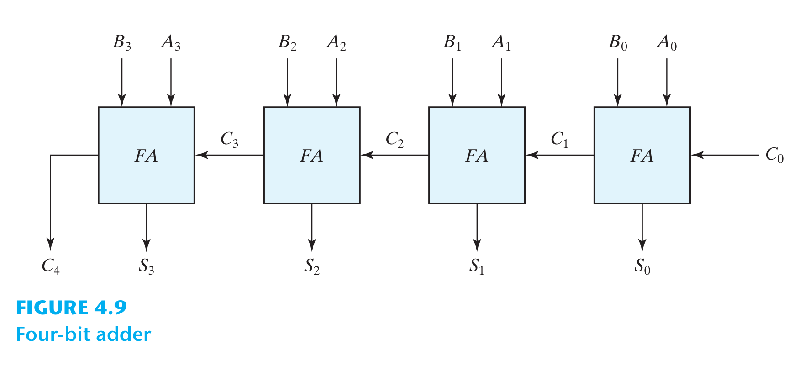

## Carry Propagation
* Mạch cộng kiểu **Ripple Carry** bên trên có nhược điểm là bit nhớ được truyền lần lượt từ $FA_1$ đến $FA_n$ để tính ra $C_1, C_2, ..., C_n; S_0, S_1, ..., S_{n-1}$ theo thứ tự. Nên sẽ có thời gian delay tăng tỷ lệ thuận với n.
* Để khắc phục nhược điểm này, người ta thiết kế ra mạch cộng sử dụng phương pháp **Carry Lookahead Generator** để tính ra $C_1, C_2, ..., C_n$ cùng 1 lúc. Mạch cộng này sẽ có thời gian thực thi nhanh hơn, nhưng đổi lại là sự phức tạp về phần cứng (cần nhiều cổng logic hơn).
* Xét mạch FA sau:
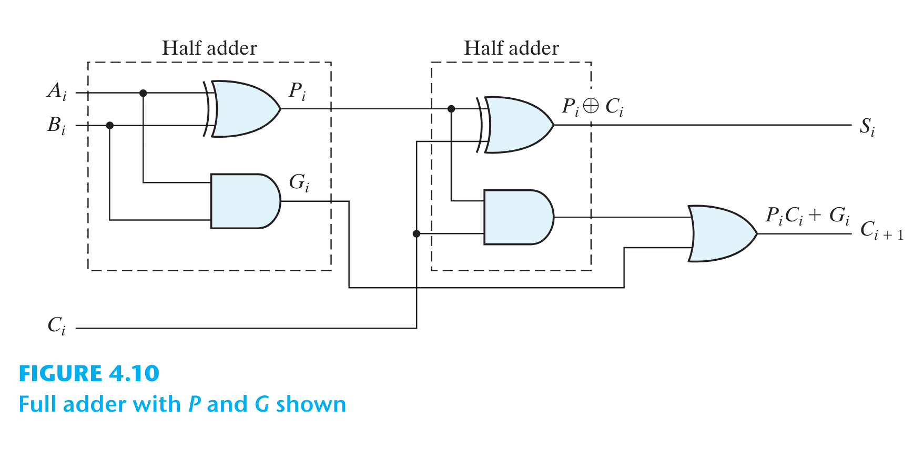
* Ta định nghĩa 2 hàm trung gian (là output của HA thứ 1):
  * $P_i = A_i \oplus B_i$.
  * $G_i = A_iB_i$.
* Hàm $P_i$ gọi là hàm tạo carry, hàm $G_i$ gọi là hàm truyền carry. 2 hàm này không phụ thuộc vào carry và có thể tính đồng thời cho cả n bits.
* Output của mỗi FA có thể viết lại như sau:
  * $S_i = P_i \oplus G_i$.
  * $C_{i+1} = G_i + P_iC_i$.
* Sau khi đã tính các hàm $P_i$ và $G_i$, ta có thể tính đồng thời $C_1, C_2, ..., C_n$ như sau:
  * $C_1 = G_0 + P_0C_0$.
  * $C_2 = G_1 + P_1C_1 = G_1 + P_1(G_0 + P_0C_0) = G_1 + P_1G_0 + P_1P_0C_0$.
  * $C_3 = G_2 + P_2C_2 = G_2 + P_2G_1 + P_2P_1G_0 + P_2P_1P_0C_0$.
  * Tương tự cho $C_4, ... ,C_n$.
* Các $C_i$ được tính đồng thời thông qua một mạch thực thi 2 mức cổng (**Carry Lookahead Generator**) như sau:
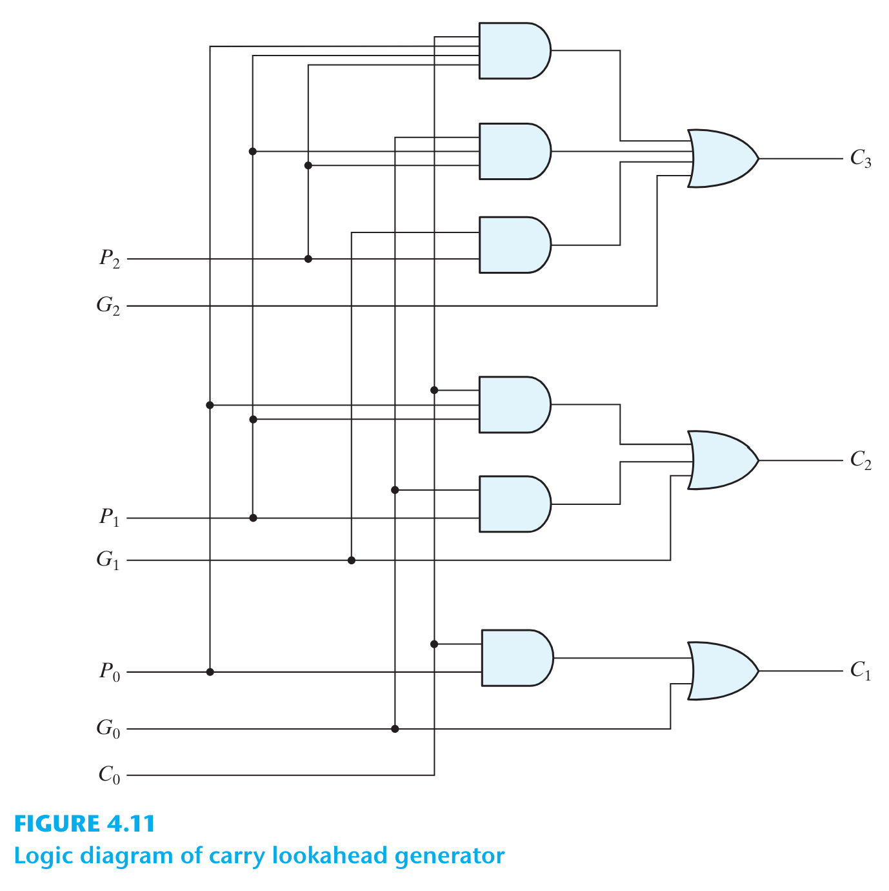
* Kết hợp lại ta có sơ đồ mạch cộng 4-bit Adder với Carry Lookahead:
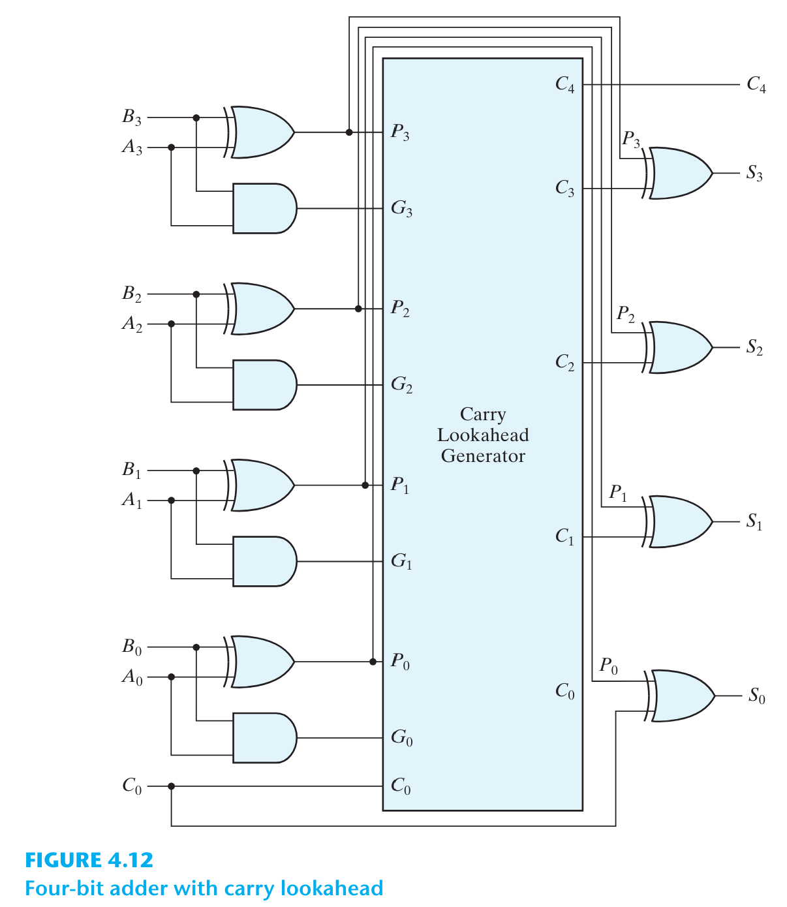 

## Binary Subtractor
* Phép trừ A - B có thể được tính bằng cách lấy A + **Bù 1** của B + 1. **Bù 1** của B có được bằng cách thêm Inverter vào mỗi bit của B. Ngoài ra, $C_0$ phải bằng 1 thay vì 0 như trong mạch cộng.
* Để xây dựng mạch Binary Adder-Subtractor, ta thêm vào 1 bit input điều khiển M.
  * Khi $M = 0 => B \oplus 0 = B; C_0 = 0$. Ta có mạch Adder.
  * Khi $M = 1 => B \oplus 1 = B'; C_0 = 1$. Lúc này ta sẽ có mạch Subtractor.
* Ngoài ra, ta thêm 1 ngõ ra $V = C_n \oplus C_{n-1}$ để phát hiện tràn số.
  * Nếu A và B là 2 số không dấu, bit $C_n$ sẽ là bit nhớ với phép cộng, là bit mượn với phép trừ.
  * Nếu A và B là 2 số có dấu, bit $V$ = 1 nghĩa là có hiện tượng tràn số.
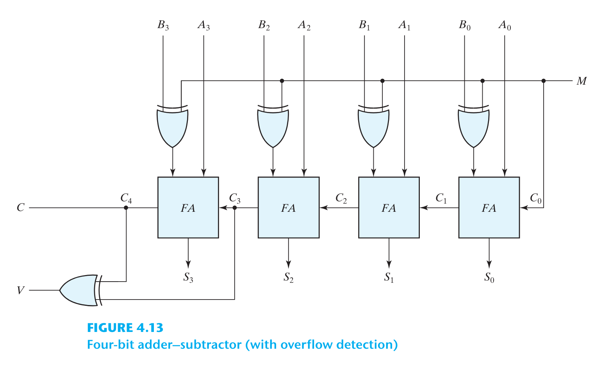

# 4.6. Decimal Adder
## BCD Adder
* Để cộng 2 chữ số trong mã BCD, trước tiên ta tiến hành cộng chuỗi nhị phân tương ứng sẽ được chuỗi 4 bit và 1 bit nhớ K. Ta lập bảng chân trị để xem sự khác nhau của chuỗi bit nhị phân và chuỗi bit BCD code của kết quả.
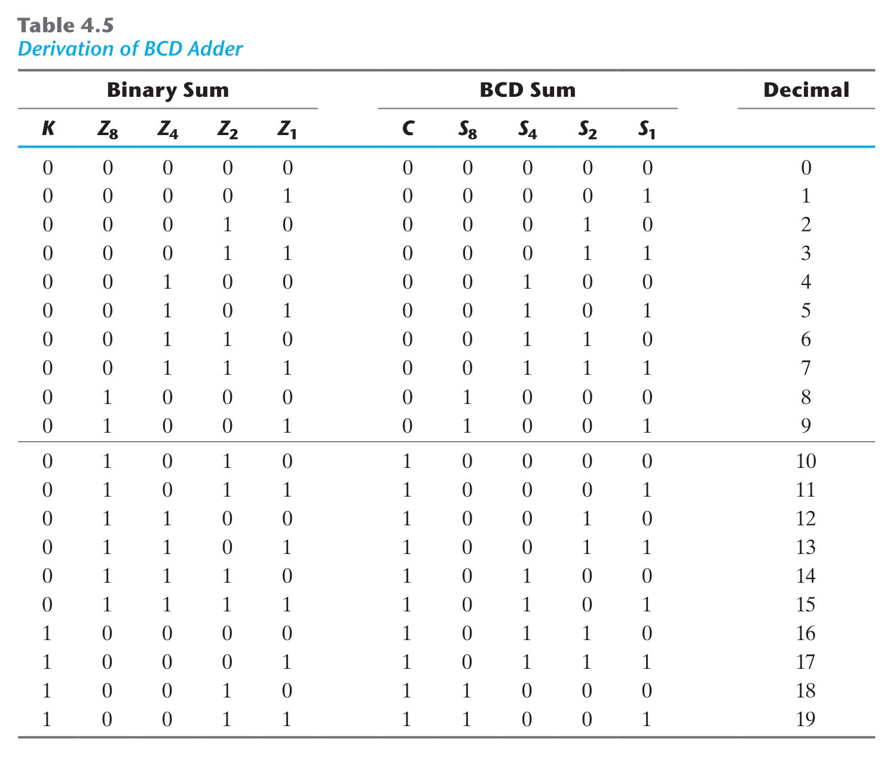
* Nhìn vào bảng, ta thấy:
  * Khi tổng nhị phân <= 1001, BCD code của tổng sẽ trùng với mã nhị phân.
  * Khi tổng nhị phân > 1001, BCD code tương ứng là không hợp lệ. Ta cần hiệu chỉnh kết quả bằng cách cộng thêm 6 (0110) vào để được BCD code đúng, đồng thời sẽ sinh ra bit nhớ C.
  * Điều kiện cần để hiệu chỉnh: (K = 1), hoặc ($Z_8$ và $Z_4$ cùng bằng 1), hoặc ($Z_8$ và $Z_2$ cùng bằng 1).
  * $C = K + Z_8Z_4 + Z_8Z_2$.
  * Khi C = 1, ta cộng 0110 vào kết quả để hiệu chỉnh.
* Mạch cộng BCD hoàn chỉnh như sau:
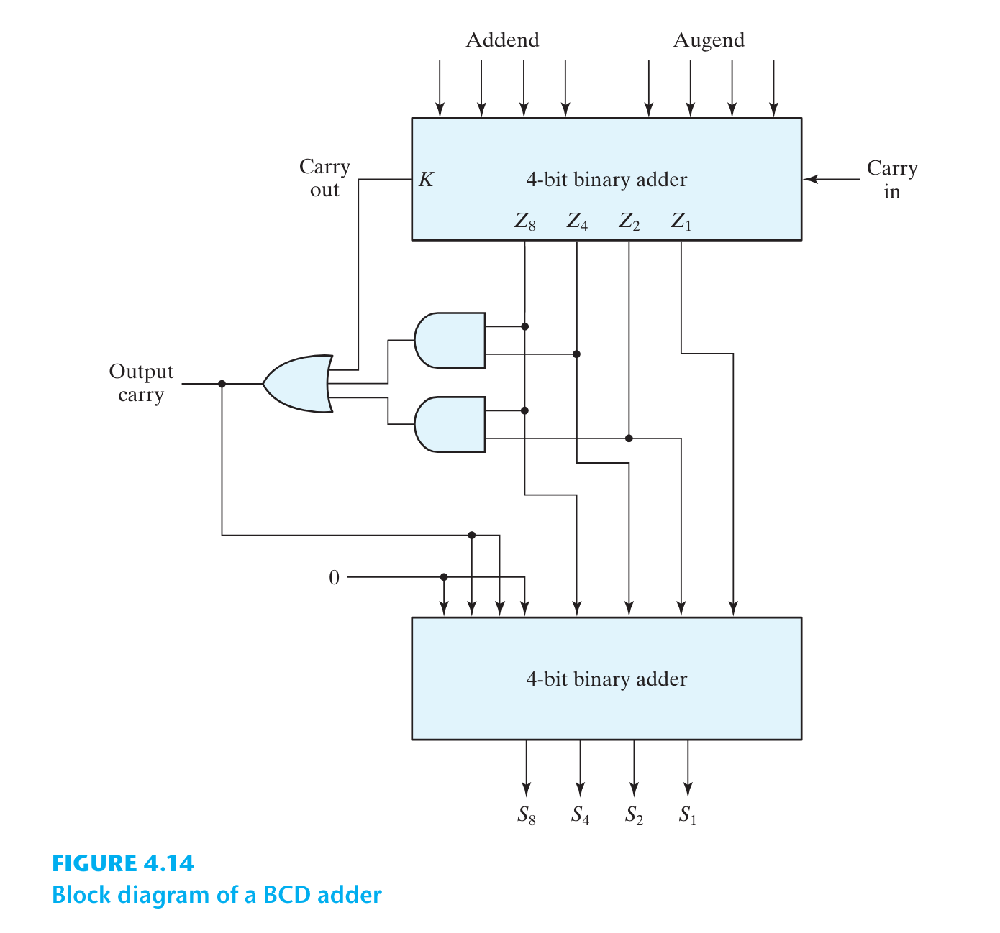

# 4.7. Binary Multiplier
* Xét phép nhân 1 số B gồm 4 bit ($B_3B_2B_1B_0$) với 1 số A gồm 3 bit ($A_2A_1A_0$).
* Phép nhân được thực hiện như phép nhân thông thường: Nhân từng chữ số của A với B rồi cộng kết quả lại theo đúng cột.
* Ta sẽ cần 12 cổng AND và 2 mạch 4-bit Adder để thực hiện phép nhân này.
* 1 cách tổng quát, khi nhân số có K chữ số với số có J chữ số, sẽ cần K*J cổng AND và (J-1) K-bit Adders.
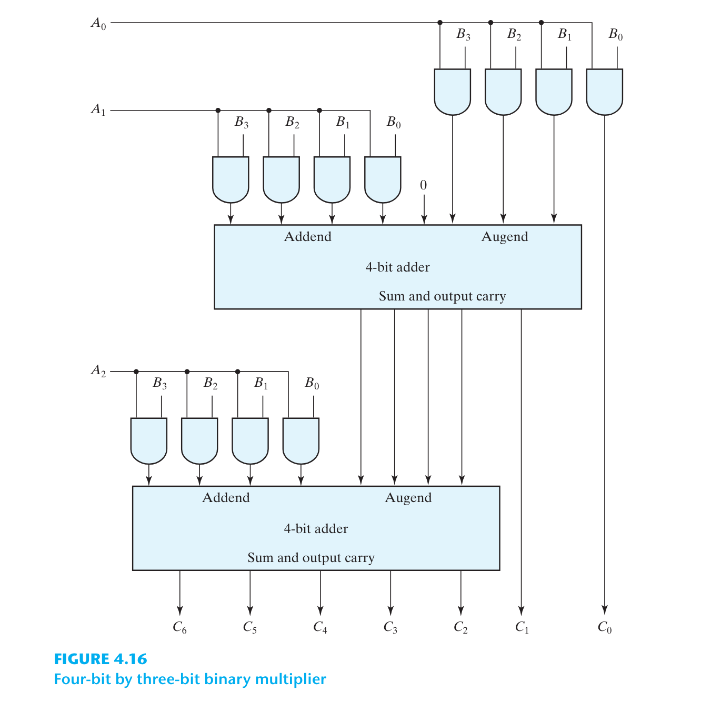

# 4.8. Magnitude Comparator
* Ta sẽ xây dựng mạch so sánh 2 số nhị phân 4-bits.
* Input là 2 số $A = A_3A_2A_1A_0$ và $B = B_3B_2B_1B_0$. Output là 3 bit xác định $(A = B),(A > B),(A < B)$.
* Nếu dùng phương pháp xây dựng bảng chân trị đối với 2 số n-bits, bảng sẽ gồm $2^{2n}$ dòng, quá phức tạp kể cả với n = 4.
* Ta sẽ dùng 1 phương pháp trực quan hơn, giống như phương pháp so sánh 2 số thông thường:
  * $A = B$ nếu tất cả các chữ số của A và B bằng nhau. Để kiểm tra $A_i = B_i$ ta dùng hàm XNOR $x_i = A_iB_i + A'_iB'_i$. Như vậy:
    * $(A = B) = x_3x_2x_1x_0$.
  * Để xác định xem $A > B$ hay $A < B$ ta so sánh từng chữ số từ trái qua đến khi gặp cặp chữ số khác nhau. Như vậy:
    * $(A > B) = A_3B'_3 + x_3A_2B'_2 + x_3x_2A_1B'_1 + x_3x_2x_1A_0B'_0$.
    * $(A < B) = A'_3B_3 + x_3A'_2B_2 + x_3x_2A'_1B_1 + x_3x_2x_1A'_0B_0$.
* Mạch thực thi sử dụng 4 cổng XNOR:
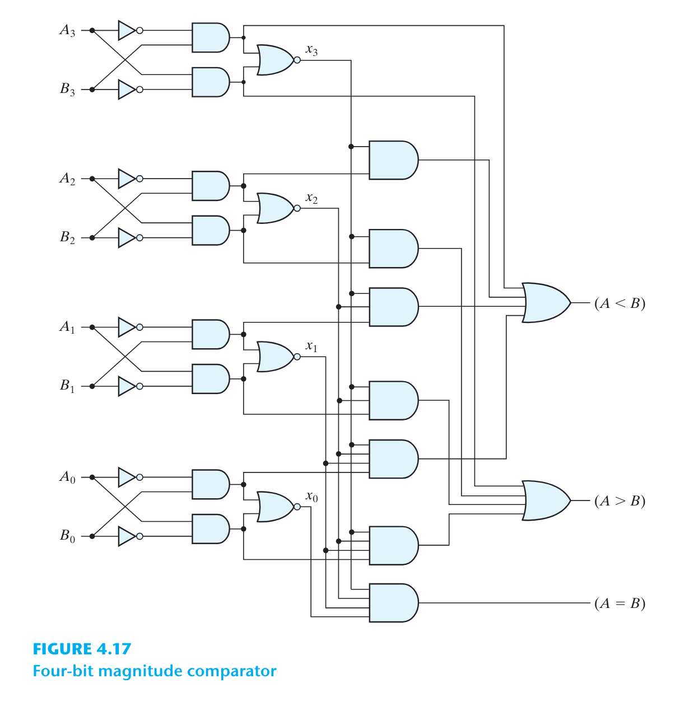

# 4.9. Decoders
* Decoder là loại mạch tổ hợp chuyển đổi thông tin nhị phân từ n tín hiệu ngõ vào sang tối đa $2^n$ tín hiệu riêng biệt ở ngõ ra.
* Ví dụ: **3-to-8 Decoder** dùng để chuyển đổi tổ hợp 3 bit nhị phân thành 1 chữ số hệ octal. Lập bảng chân trị
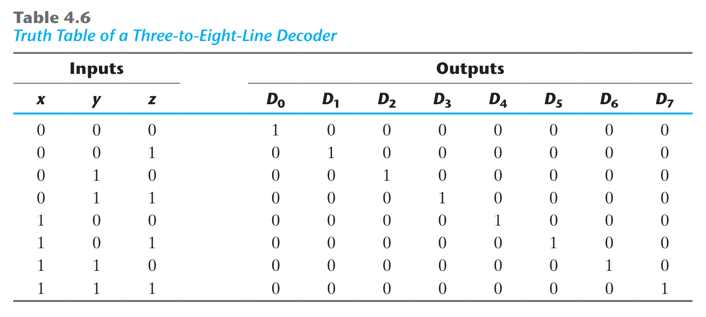
* Dễ dàng xây dựng mạch thực thi từ bảng chân trị trên
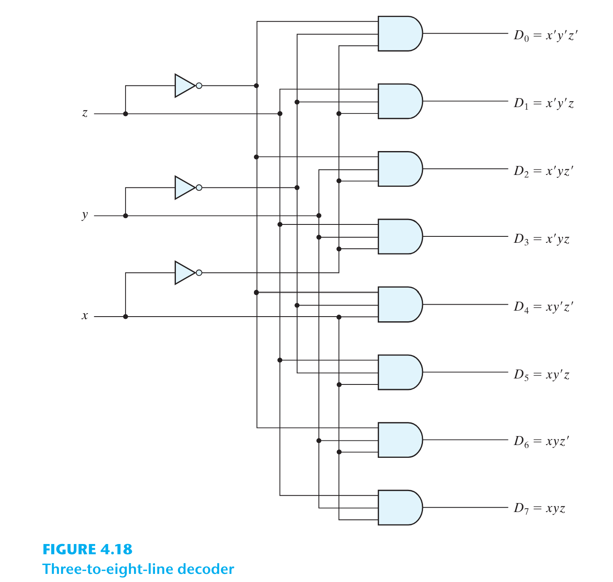
* Ta có thể thêm vào 1 enable input. Lúc này mạch sẽ tương đương với 1 *demultiplexer*.
* Ví dụ, mạch **2-to-4 Decoder with enable input** sau đây tương đương với **1-to-4 Demultiplexer** (E là *data input line*, A và B là *selection inputs*):
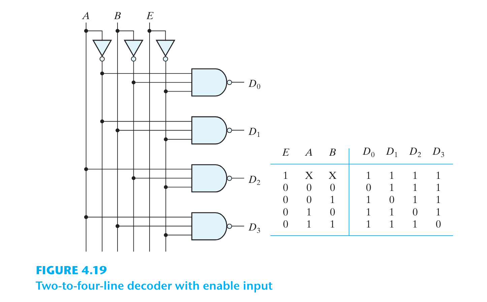
* Decoder với enable input có thể kết nối với nhau để tạo nên mạch Decoder lớn hơn. Ví dụ: 2 mạch **3-to-8 Decoder with enable input** kết nối lại tạo thành mạch **4-to-16 Decoder**:
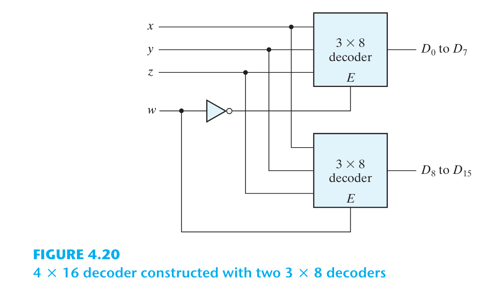

## Thực thi mạch tổ hợp với Decoders
* Decoder có thể được ứng dụng để thực thi mạch tổ hợp bất kỳ.
* 1 mạch tổ hợp có n inputs và m outputs có thể được thực thi với 1 mạch **$n-to-2^n$ Decoder** kết hợp với m cổng OR.
* Ví dụ: Xét mạch Full-Adder với 3 biến đầu vào x, y, z. Dựa vào bảng chân trị của mạch Full-Adder bên trên ta có:
  * $S(x, y, z) = \sum(1, 2, 4, 7)$.
  * $C(x, y, z) = \sum(3, 5, 6, 7)$.
* Ta có thể thực thi 2 hàm này với 1 mạch **3-to-8 Decoder** và 2 cổng OR 4-input như sau:
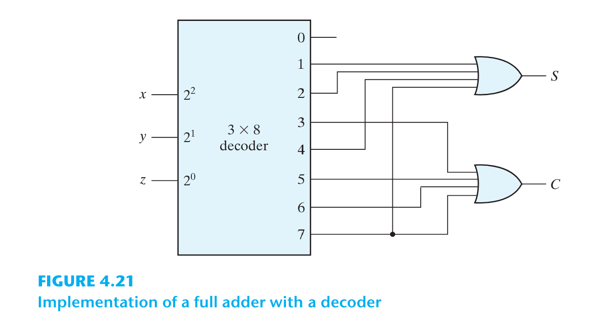
