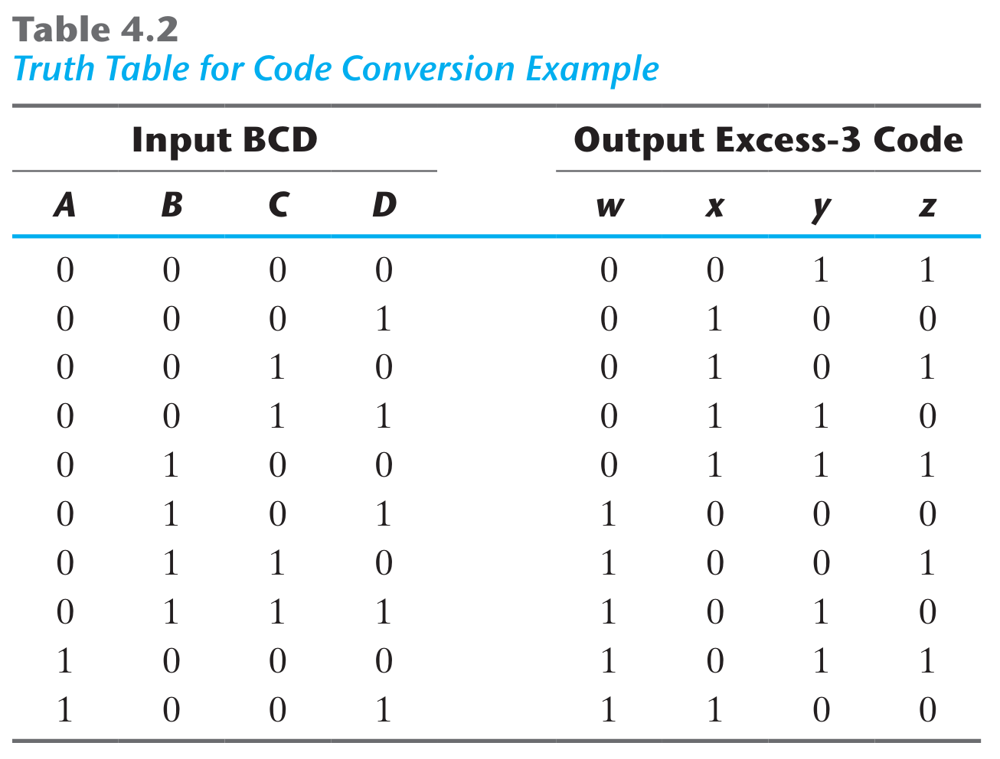
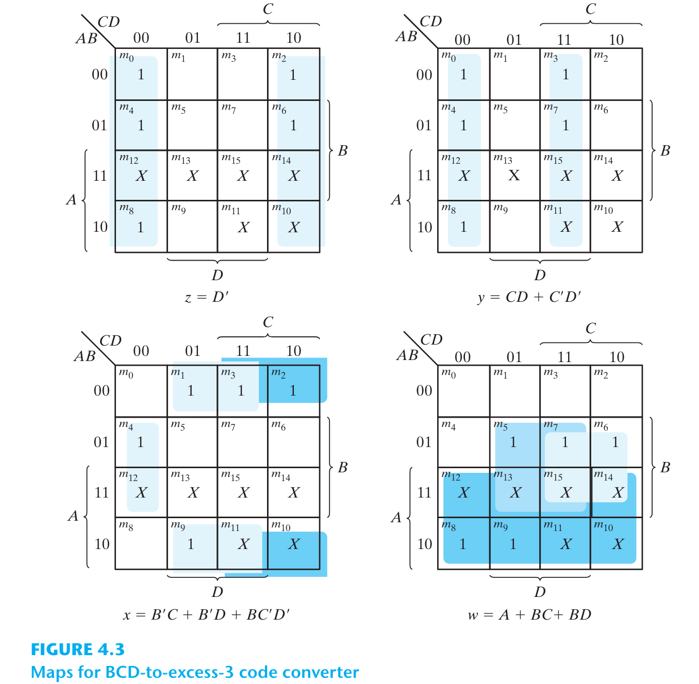
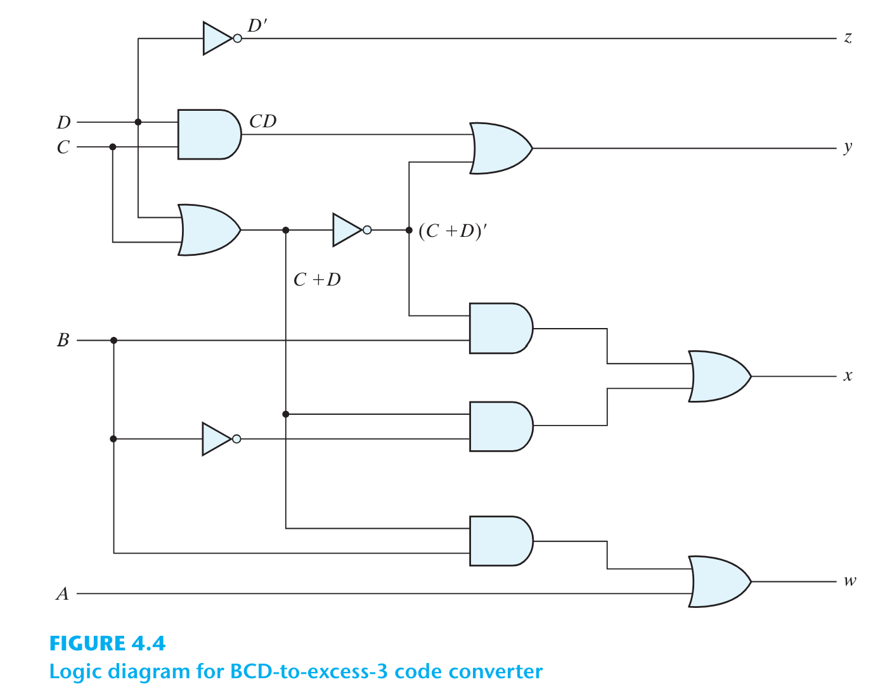
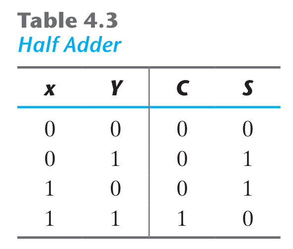
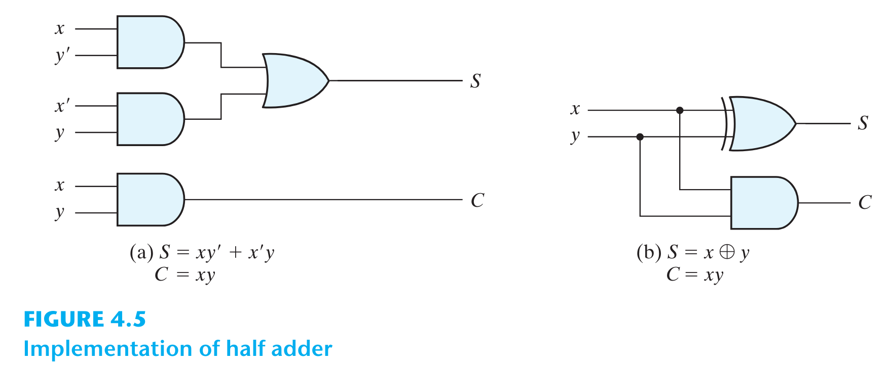

# CHAPTER 4 - COMBINATIONAL LOGIC

# 4.1. Introduction
* Mạch logic được chia thành 2 loại:
  * Mạch tổ hợp: Output chỉ phụ thuộc vào Inputs
  * Mạch tuần tự: Có các phần tử nhớ lưu trữ thông tin trong mạch. Output phụ thuộc vào Inputs và trạng thái của các phần tử nhớ hiện tại.

# 4.2. Mạch tổ hợp

# 4.3. Phân tích mạch tổ hợp
* Sơ đồ mạch tổ hợp chỉ gồm các cổng logic, không có đường hồi tiếp (feedback) hay phần tử nhớ (latch, flip-flop).

# 4.4. Quy trình thiết kế
## Mạch chuyển mã BCD -> Excess-3 code
* Tổ hợp bit tương ứng của *BCD* và *Excess-3* code được tổng hợp thành bảng chân trị sau:

* Từ bảng chân trị ta xây dựng K-map cho từng bit output:

* Từ K-map trên thu được các hàm tối giản. Biến đổi hàm 1 chút để tạo nhân tử chung nhằm tận dụng cổng chung khi thực thi mạch:
  * $z = D'$.
  * $y = CD + C'D' = CD + (C + D)'$.
  * $x = B'C + B'D + BC'D' = B'(C + D) + BC'D' = B'(C + D) + B(C + D)'$.
  * $w = A + BC + BD = A + B(C + D)$.

* Mạch thực thi gồm 4 cổng AND, 4 cổng OR, 2 cổng NOT. Nếu thực thi mạch theo dạng *sum of products* ban đầu thì cần đến 6 cổng AND, 3 cổng OR, 3 cổng NOT.
* Ta thấy không phải lúc này hàm tối giản dạng chuẩn cũng là hàm tối ưu khi thực thi mạch, vì ta có thể tận dụng các subcircuits để tiết kiệm cổng. Các công cụ tổng hợp logic mặc định sẽ tìm và tận dụng các subcircuits này.

## Mạch cộng, mạch trừ
* Mạch bán cộng (half adder) cộng 2 bit ở ngõ vào, đầu ra là 1 bit tổng và 1 bit nhớ.
* Mạch cộng toàn phần (full adder) có thêm 1 bit nhớ ở ngõ vào. Mạch cộng toàn phần có thể xây dựng từ 2 mạch bán cộng.
* Khi kết hợp n mạch cộng toàn phần thành chuỗi ta sẽ được mạch cộng nhị phân n bit.
* Có thể sửa đổi mạch cộng nhị phân 1 chút để có được mạch cộng-trừ nhị phân.

## Mạch cộng bán phần (Half Adder)
* Half adder gồm 2 bit đầu vào x, y. Ngõ ra gồm bit tổng C, bit nhớ C. Bảng chân trị:

* Hàm thực thi dạng *sum of products*:
  * $S = x'y + xy'$.
  * $C = xy$.
* Mạch thực thi dạng *sum of products* trong hình (a). Hình (b) vẽ sơ đồ mạch dùng cổng XOR và cổng AND.

